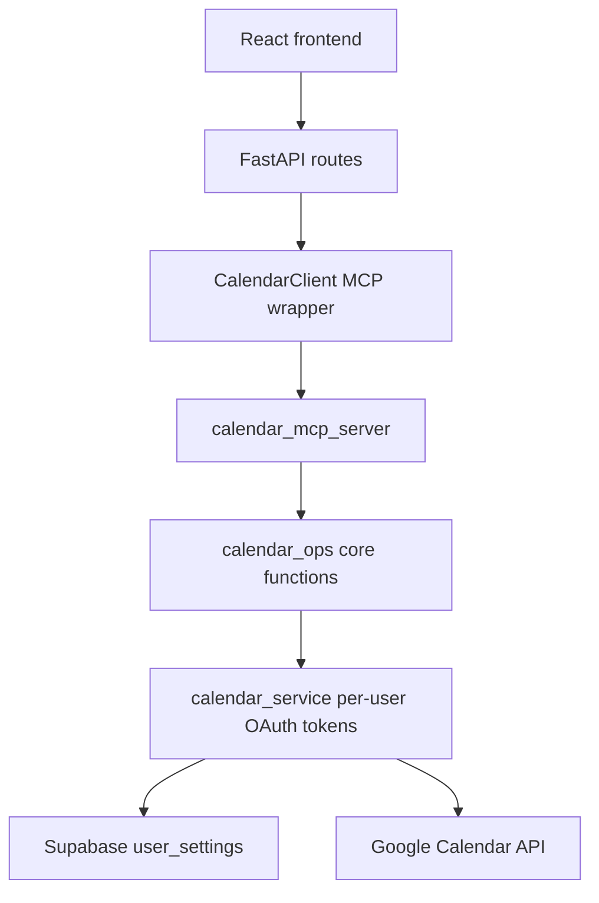
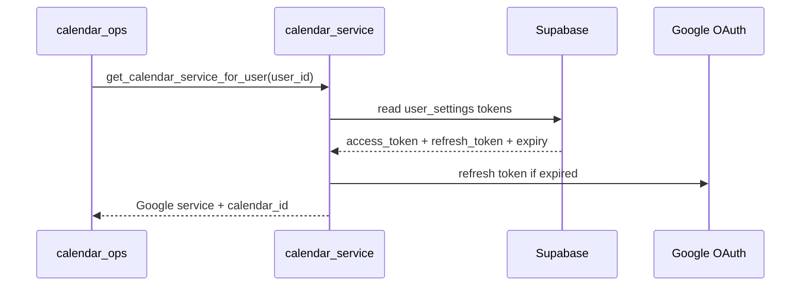
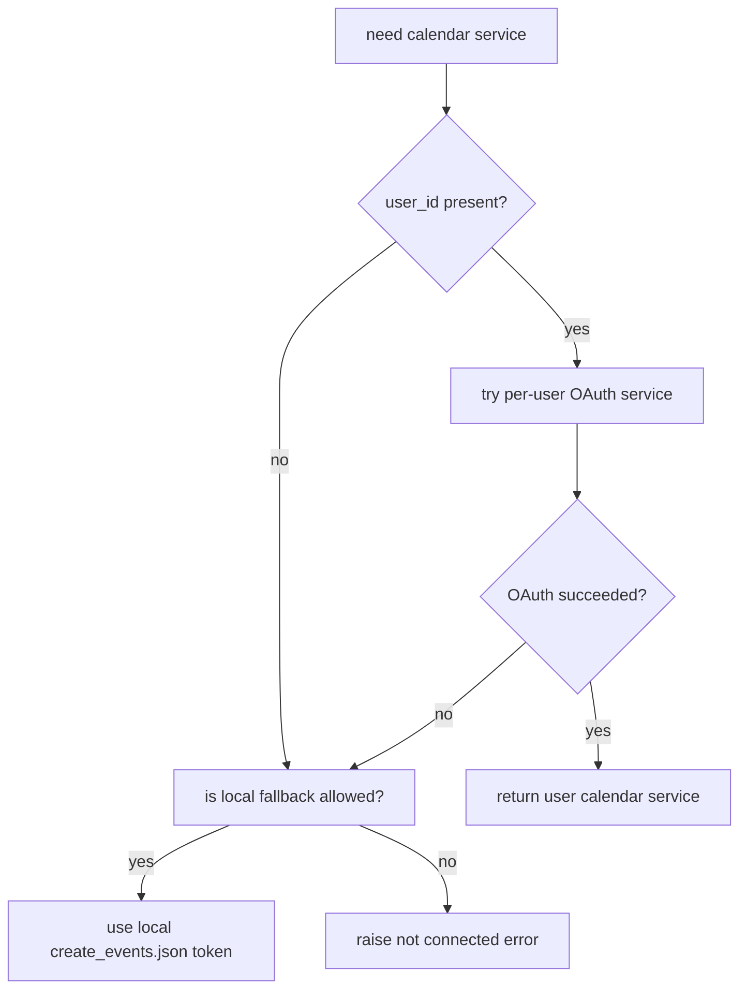
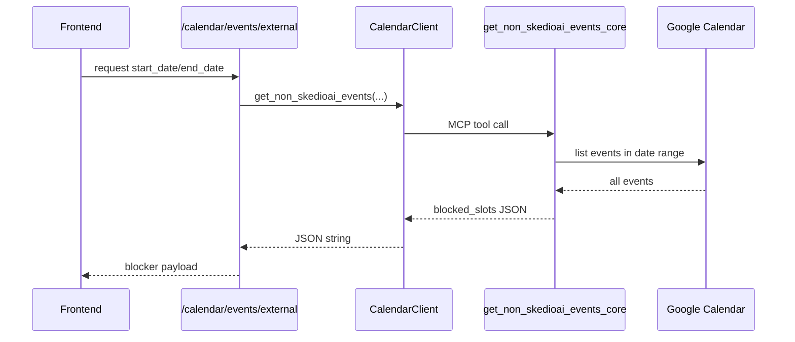
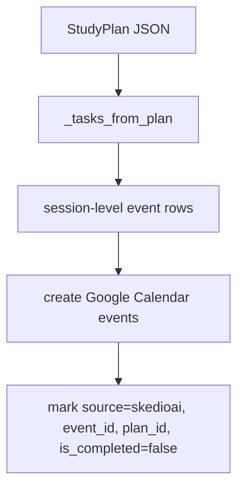
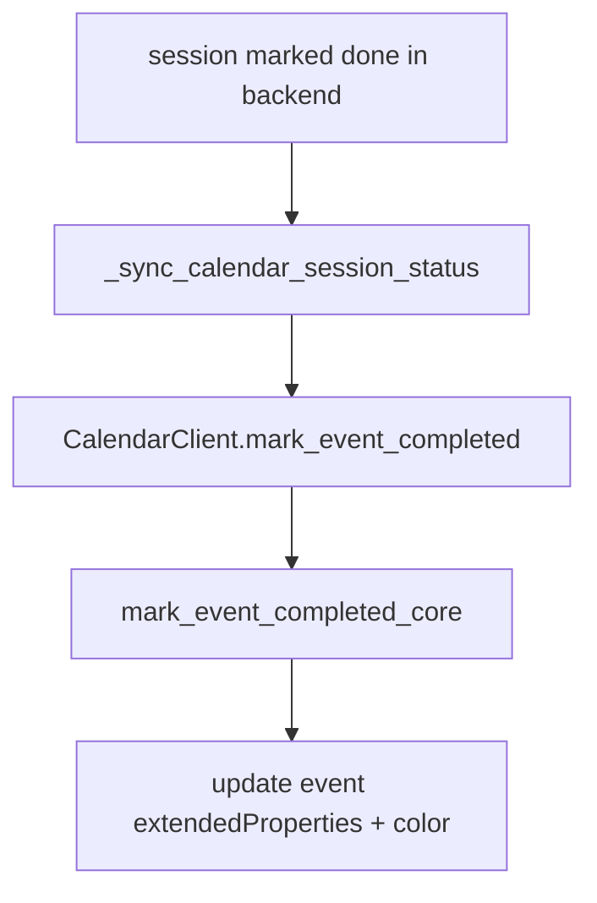
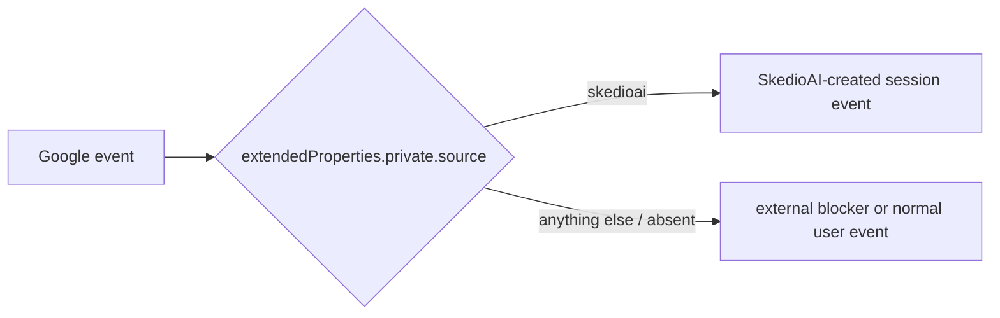
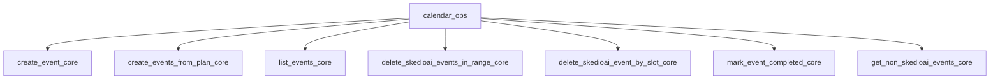
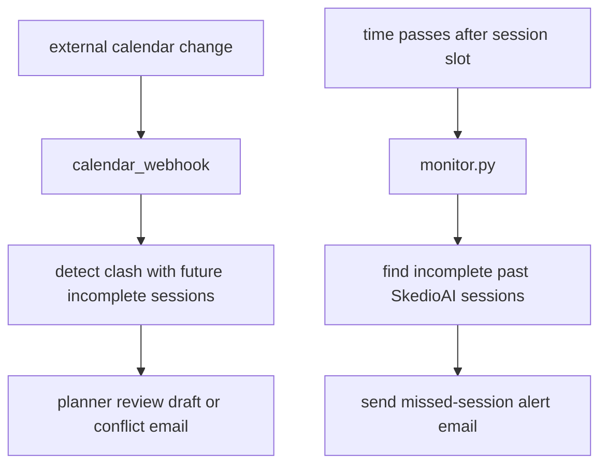
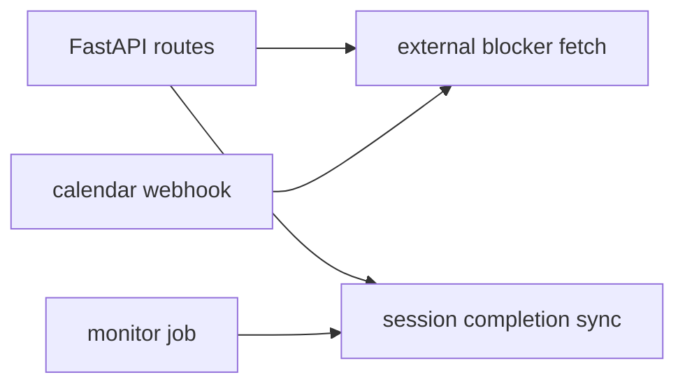

# Calendar Diagram

This document maps the live calendar stack used by SkedioAI.

Relevant files:
- `src/tools/calendar_ops.py`
- `src/api/calendar_service.py`
- `src/tools/test_mcp_client.py`
- `src/api/routes.py`
- `src/api/calendar_webhook.py`
- `src/agents/monitor.py`

This is a layered system:
- per-user OAuth token retrieval
- Google Calendar API helpers
- MCP client wrapper
- FastAPI integration
- webhook clash handling
- missed-session monitoring

---

## High-Level Calendar Stack



---

## Main Layers

### 1. `calendar_service.py`

Purpose:
- fetch per-user Google Calendar tokens from Supabase
- refresh them when expired
- build a Google Calendar service for that user

Main functions:
- `get_supabase`
- `get_calendar_service_for_user`
- `is_calendar_connected`

### 2. `calendar_ops.py`

Purpose:
- core calendar operations against Google Calendar
- fallback to local dev token when allowed

Main functions:
- `create_event_core`
- `create_events_from_plan_core`
- `list_events_core`
- `delete_skedioai_events_in_range_core`
- `delete_skedioai_event_by_slot_core`
- `mark_event_completed_core`
- `get_non_skedioai_events_core`

### 3. `test_mcp_client.py`

Purpose:
- MCP client wrapper used by the app/backend

Main methods:
- `connect`
- `disconnect`
- `_call`
- `create_event`
- `create_events_from_plan`
- `list_events`
- `delete_skedioai_events_in_range`
- `delete_skedioai_event_by_slot`
- `mark_event_completed`
- `get_non_skedioai_events`

### 4. `routes.py`

Purpose:
- initialize shared calendar client
- expose blocker data to frontend
- sync session completion state to calendar

### 5. `calendar_webhook.py`

Purpose:
- detect external calendar changes that clash with future incomplete SkedioAI sessions
- trigger planner review flow when needed

### 6. `monitor.py`

Purpose:
- periodically detect missed incomplete SkedioAI study sessions
- send alert emails

---

## Authentication / Token Flow



Important rule:

```text
Production should use per-user OAuth tokens.
Local fallback token is a dev convenience only.
```

---

## Fallback Rule

`calendar_ops.py` supports a local fallback path.



This is why local dev can work even when a user has not connected calendar.

---

## Non-SkedioAI Blocker Read Path

This is the most important calendar read path for planning.



What `get_non_skedioai_events_core` does:
- includes non-SkedioAI events as blockers
- also treats completed SkedioAI events as blocked or completed time
- returns:
  - `has_blocks`
  - `blocked_slots`
  - `summary`

This is why planner and revision flows can avoid double-booking over real commitments.

---

## Create Events From Plan Path



Important rule:

```text
Calendar events are created at session level.
Checklist or content items live in the event description, not as separate calendar events.
```

---

## Completion Sync Path

When the user completes a session, the backend can mirror that into calendar:



Live behavior:
- marks `is_completed=true/false`
- may set event color
- is best-effort, not the source of truth

Important rule:

```text
Neo4j completion is authoritative.
Calendar completion is a sync side effect.
```

---

## SkedioAI vs Non-SkedioAI Event Distinction



This distinction drives:
- deletion behavior
- blocker extraction
- completion updates
- missed-session detection

---

## Main Calendar Operations



### `create_event_core`
- create one SkedioAI event

### `create_events_from_plan_core`
- explode a plan into session events

### `list_events_core`
- read events in range

### `delete_skedioai_events_in_range_core`
- remove only unfinished SkedioAI events

### `delete_skedioai_event_by_slot_core`
- delete one matching SkedioAI event

### `mark_event_completed_core`
- toggle completion state on one event

### `get_non_skedioai_events_core`
- extract blocker slots for planning

---

## Webhook vs Monitor Split



The webhook is the immediate clash responder.
The monitor is the background missed-session watcher.

---

## Backend Integration Points

Current main usages:



In practice:
- frontend uses external blockers for display
- planner and webhook-driven revision use blockers for schedule safety
- monitor uses completion metadata to detect missed study sessions

---

## Debugging Questions

When calendar behavior is wrong, ask:

1. Was this supposed to use per-user OAuth or local fallback?
2. Did `CalendarClient` connect successfully?
3. Did the MCP layer call the correct core function?
4. Was the event actually tagged with `source=skedioai`?
5. Is the issue in Google Calendar state, or in SkedioAI's interpretation of it?

That usually separates:
- auth/token bugs
- MCP connectivity bugs
- event-tagging bugs
- blocker-interpretation bugs
