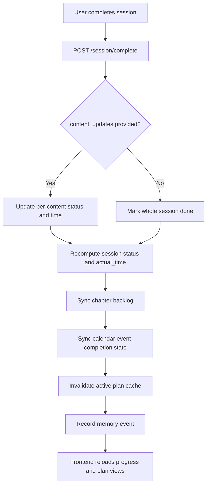
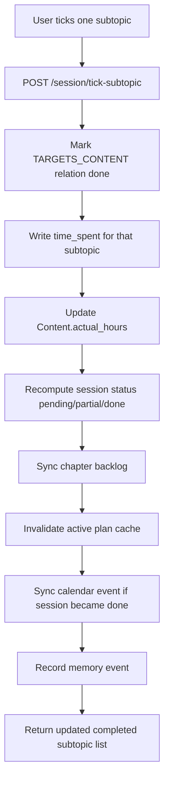
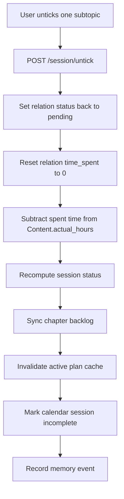

# Session Completion and Progress Flow

## Purpose

This document explains how SkedioAI handles:

- session completion
- subtopic tick / untick behavior
- actual-hours truth
- backlog progress refresh
- dashboard/progress updates
- memory side effects

This is one of the most important product flows because it is where the plan stops being only a promise and starts becoming lived progress.

## Core Product Idea

SkedioAI does not treat progress as one vague number.

It tracks progress through a layered model:

- `Session` status
- `Content` / subtopic completion inside the session
- `time_spent` truth on session-content relationships
- chapter backlog refresh
- aggregated progress surfaces

So the operational idea is:

```text
small checkbox truth
-> session truth
-> chapter progress truth
-> dashboard truth
```

## The Main Completion Paths

The current system supports three major progress actions:

1. complete a whole session
2. tick one subtopic inside a session
3. untick or undo progress

These are not all the same thing.

## 1. Whole-session completion

This path is used when the learner marks the entire session complete.

The current flow is:



### If `content_updates` are provided

SkedioAI uses fine-grained updates:

- each targeted content item gets its own `status`
- each targeted content item gets its own `time_spent`
- session `actual_time` is recomputed from done content
- session status becomes:
  - `done` if all contents are done
  - `partial` if some are done
  - `skipped` if all are skipped
  - `pending` otherwise

This is the more precise path.

### If `content_updates` are not provided

SkedioAI uses coarse whole-session completion:

- session is marked `done`
- actual session hours come from:
  - `req.actual_hours` if provided
  - otherwise the session’s estimated hours
- time is distributed equally across all content items linked to the session

This is simpler, but less expressive than per-content updates.

## 2. Tick one subtopic

This path is used when the learner checks one content item rather than the whole session.

The flow is:



### Important truth here

The atomic progress truth is not just “session done.”

It also lives on the relationship:

- `Session -[:TARGETS_CONTENT]-> Content`

That relationship stores:

- `status`
- `time_spent`
- `completed_at`

This is why subtopic ticking matters so much.
It is not a cosmetic checkbox.

## 3. Untick / undo progress

There are two different rollback shapes.

### Untick one subtopic

This reopens a single content item.

Flow:



### Undo full session

This reopens the whole session:

- session status returns to `pending`
- session `actual_time` becomes `0`
- all linked content relations return to `pending`
- their `time_spent` becomes `0`

This is a stronger reset than unticking one content item.

## Actual Hours Truth

One of the most important design details is that actual hours are not purely stored at one level.

### Session level

The session stores:

- `actual_time`

This is a summary view of what happened in that session.

### Content level

Each content node accumulates:

- `actual_hours`

### Relationship level

The session-to-content relationship stores:

- `time_spent`

This relationship-level field is the most operationally important one for session progress.

That means the truth shape is roughly:

```text
time_spent on session-content edge
-> rolls into session actual_time
-> also rolls into content actual_hours
```

## Why the system is shaped this way

This design exists because one session can contain multiple checkbox items.

If SkedioAI only tracked progress at the session level, it would lose:

- partial completion truth
- subtopic-level progress
- cleaner backlog refresh
- better actual-hours attribution

So the system chose a more detailed structure even though it is more complex.

## Backlog Refresh After Progress

After completion-related changes, SkedioAI runs chapter backlog sync.

That sync reads completed and pending content across performed sessions and produces chapter-level backlog summaries such as:

- `DONE`
- `IN_PROGRESS`
- `NOT_STARTED`

The backlog layer therefore reflects progress truth that emerged from actual session interaction, not only from old planning assumptions.

This is an important design choice:

```text
planner creates intended work
progress actions create lived work truth
backlog sync reconciles the difference
```

## Calendar Side Effects

Progress changes also affect the calendar integration.

When a session becomes complete or incomplete, the system attempts to sync that state to the related calendar event.

So calendar is not only an input source.
It also reflects the current completion state of SkedioAI-created sessions.

This helps the system support:

- missed-session detection
- more accurate event status
- better external visibility of what was actually done

## Cache and Fresh Reads

After progress mutations, the active plan cache is invalidated.

That matters because the active plan snapshot is reused across several parts of the system.

Without invalidation, the frontend and planner-facing context could keep stale completion truth for too long.

## Memory Side Effects

After meaningful session outcomes, SkedioAI may schedule learner-memory synthesis.

The current idea is:

- complete / partial / subtopic outcomes can trigger periodic behavior analysis
- skipped / missed outcomes are treated as stronger friction signals and can force deeper synthesis

This memory step is best-effort.
If the model key is unavailable, the main progress flow still succeeds.

So memory is downstream enrichment, not the main truth writer.

## How Progress Surfaces Are Built

Progress endpoints are not magic.
They aggregate plan/session/content truth into UI-friendly payloads.

### Progress view

The progress payload is built by grouping the active plan by:

- subject
- chapter
- subtopics

It then computes:

- estimated hours
- actual hours
- subtopics completed
- percent progress
- coarse status such as `pending`, `in_progress`, or `done`

### Dashboard stats

Dashboard stats aggregate:

- hours studied
- hours remaining
- hours target
- total subtopics
- done subtopics
- total sessions
- completed sessions
- topic breakdown
- daily planned hours

So the dashboard is an aggregate view on top of lower-level progress truth, not a separate source of truth.

## What Tick / Untick Really Means

The clean product interpretation is:

- `tick-subtopic` means one atomic learning item was completed and optionally consumed some time
- `untick` means that atomic completion claim is being revoked
- `undo session` means the whole session completion state is being reopened

This is why these actions should be documented as product behaviors, not tiny checkbox UI details.

## Important Tradeoffs and Gaps

This flow is strong, but not perfect.

### 1. Coarse full-session completion is less precise

If the learner marks the whole session complete without detailed content updates, time is distributed evenly across contents.

That is practical, but it is still an assumption.

### 2. `actual_hours` depends on user-supplied or UI-supplied truth

The system does not independently measure study time.
It trusts the provided value or falls back to estimated hours.

This is one of the biggest realism limitations in the current flow.

### 3. Subtopic semantics depend on planner quality

If planned content items are weak or vague, the progress layer inherits that weakness.

That is why planner checkbox quality matters so much.

### 4. Memory enrichment is optional

Progress truth is durable even without memory synthesis.
But the higher-level personalization benefits are weaker if memory cannot run.

## Why This Flow Exists

SkedioAI is trying to be more than a planner that disappears after plan creation.

This progress architecture exists so the system can:

- preserve subtopic-level learning truth
- support partial completion honestly
- keep chapter backlog updated
- power progress visuals
- learn from what the student actually does, not only what they said earlier

That is the deeper reason the session completion flow matters so much.
