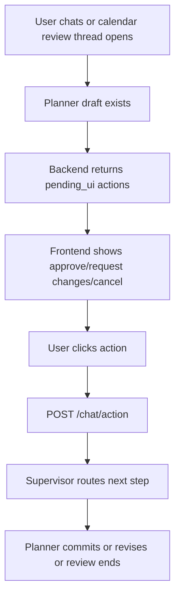

# API and Frontend Runtime Flow

## Purpose

This document explains how the frontend and backend actually meet in SkedioAI.

It focuses on:

- the main API surfaces
- what the frontend sends
- what the backend returns
- how authentication scopes user data
- how review, chat, and progress all connect

This is not meant to be an OpenAPI dump.
It is the product-runtime map.

## Runtime Philosophy

SkedioAI is not a static dashboard that calls one giant endpoint.

The frontend talks to several focused backend contracts:

- workspace bootstrap and plan views
- progress and stats views
- session interaction routes
- chat and review routes
- memory and integration routes

The idea is:

```text
UI surface
-> small purpose-built API contract
-> authenticated user-scoped backend logic
-> durable truth + orchestration state
```

## Authentication and User Scoping

The backend uses authenticated user identity as a hard boundary.

Most operational routes depend on:

- `get_current_user`

That means the frontend does not send an arbitrary user id for normal product actions.
The backend derives the acting user from auth.

This matters because the system must isolate:

- active plans
- sessions
- review threads
- calendar tokens
- learner memory
- email recipient resolution

## Thread Scoping for Chat and Review

Chat is not global.
It is thread-scoped and user-scoped.

The backend normalizes thread ids into a safe scoped format roughly like:

```text
user:{user_id}:thread:{thread_name}
```

This means:

- two users can both have a `main` thread safely
- planner review can live in a dedicated review thread
- email review links can reopen the correct supervisor state

This is one of the more important backend correctness decisions.

## Main Frontend Runtime Surfaces

The current frontend/backend relationship is easiest to understand as five main surfaces.

### 1. Workspace bootstrap

This is the broad initial load path.

It returns:

- active plan
- progress payload
- dashboard stats

The practical idea is:

```text
frontend opens workspace
-> GET /app/bootstrap
-> render plan + progress + stats from one backend payload
```

### 2. Plan and progress views

These routes support plan visualization and metrics:

- `GET /plan/week`
- `GET /plan/active`
- `GET /plan/progress`
- `GET /stats/dashboard`
- `GET /stats/graph`
- `GET /plan/today`

These are read surfaces.
They let the app show:

- grouped sessions
- progress bars
- dashboard cards
- knowledge graph
- today summary

### 3. Session interaction

These routes mutate progress truth:

- `POST /session/complete`
- `POST /session/undo`
- `POST /session/tick-subtopic`
- `POST /session/untick`
- `POST /session/skip`

This is where the frontend sends actual user interaction about what was done.

### 4. Chat and review

These routes power orchestration:

- `POST /chat/send`
- `POST /chat/send/stream`
- `GET /chat/pending-review`
- `POST /chat/action`
- `DELETE /chat/reset/{thread_id}`

This is the live system bridge into supervisor, intake, planner, and user-facing output.

### 5. Integrations and settings

These routes support external connectivity:

- `GET /email/status`
- calendar OAuth routes under `/auth/calendar/...`
- `GET /calendar/events/external`

These are not the study flow itself, but they strongly affect the realism of the study flow.

## What the Frontend Sends for Session Actions

### Complete full session

`POST /session/complete`

Frontend may send:

- `session_id`
- optional `actual_hours`
- optional `content_updates`

If `content_updates` are present, the backend uses fine-grained per-content truth.
If not, it uses whole-session completion logic.

### Tick subtopic

`POST /session/tick-subtopic`

Frontend sends:

- `session_id`
- `content_match_key`
- optional `time_spent`

This is the checkbox-style atomic completion path.

### Untick subtopic

`POST /session/untick`

Frontend sends:

- `session_id`
- `content_match_key`

This reopens that one content item.

### Undo session

`POST /session/undo`

Frontend sends:

- `session_id`

This reopens the whole session state.

## What the Frontend Sends for Chat and Review

### Normal chat turn

`POST /chat/send`

Frontend sends:

- `message`
- optional `thread_id`
- optional `ui_context`

This is the standard non-streaming route.

### Streaming chat turn

`POST /chat/send/stream`

Same logical input as normal chat, but the response is streamed as NDJSON chunks.

### Review action

`POST /chat/action`

Frontend sends:

- `action`
- optional `thread_id`

Examples:

- `approve_plan`
- `request_changes`
- `cancel_plan`

### Pending review fetch

`GET /chat/pending-review`

Frontend asks for the current reviewable planner draft for one review thread.

This is especially useful after:

- opening the app from an email review link
- reloading during a pending draft state

## What the Backend Returns for Chat

The backend normalizes supervisor state into one frontend-friendly contract:

- `thread_id`
- `reply`
- `phase`
- `plan_committed`
- `actions`
- optional `draft_plan`
- optional `pending_ui`

This is important because the frontend does not need to understand the full internal supervisor state shape.
It gets a smaller operational contract.

## Review Flow from the Frontend’s Point of View

The product path is:



The important design idea is that review is not a frontend-only state.
It is backed by persisted supervisor thread state.

## Streaming Chat Behavior

The streaming route emits:

- incremental user-facing text chunks
- then one final structured `done` payload

This is a strong product choice because it gives:

- faster perceived response
- a smoother user experience
- one final authoritative payload for actions and draft data

So the model is:

```text
stream for feel
structured final payload for truth
```

## Why the API Is Shaped This Way

The backend does not expose raw agent internals directly to the UI because that would make the frontend fragile.

Instead, the system uses:

- worker-specific logic internally
- compact UI-facing contracts externally

This keeps:

- frontend simpler
- orchestration freer to evolve
- review and draft handling more stable

## Practical Auth and Session Story

The current practical auth/session model is:

```text
user logs in
-> backend derives authenticated user_id
-> every operational request is scoped to that user
-> chat/review threads are namespaced under that user
-> calendar tokens and alert email lookup are also user-scoped
```

This is enough for a production-style single-user-account-per-learner system.

It is not a multi-tenant admin-control doc.
It is the current practical learner-isolation story.

## Important Tradeoffs

### 1. The backend contract is practical, not perfectly formalized

There is strong runtime structure, but the product still relies on code-level conventions rather than a separately published API spec.

### 2. Review relies on thread persistence

This is powerful, but it means review behavior is tightly coupled to checkpointer-backed supervisor state.

### 3. Some routes are product-rich, not just CRUD

For example:

- `/chat/send`
- `/chat/action`
- `/session/complete`

These are workflow routes, not simple database wrappers.

That is appropriate for this product, but it also means good docs matter more.

## Why This Document Matters

Without this layer, the system can feel mysterious:

- where does the frontend get progress from?
- how does email review reopen the app?
- why does one button change planner state?

This document exists so those questions have one operational answer.
