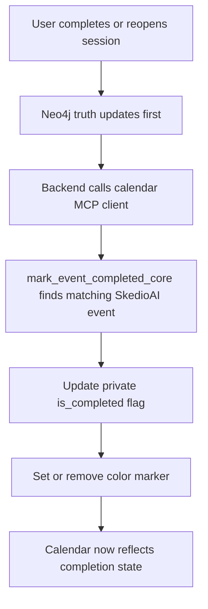

# Calendar Writeback and Sync

## Purpose

This document explains how SkedioAI interacts with Google Calendar after a plan exists.

It focuses on:

- how SkedioAI writes events into the calendar
- what metadata it attaches
- how completion updates sync back
- how webhook and monitor logic depend on that metadata
- why calendar is both an input source and a reflected output surface

## Calendar’s Role in the Product

Calendar in SkedioAI is not just a passive external reference.

It plays three different roles:

1. **availability evidence**
2. **external schedule surface for SkedioAI sessions**
3. **change signal source for clash detection**

So the current idea is:

```text
calendar helps shape the plan
calendar displays the plan
calendar later tells the system when reality changed
```

## Writing SkedioAI Events

When SkedioAI creates plan sessions in Google Calendar, it writes them as session-level events.

Checklist items remain inside the event description rather than becoming separate calendar events.

That is an intentional choice:

- calendar stays readable
- study sessions remain the scheduling unit
- subtopics remain the execution/checklist unit

## Event Shape

When events are created from a plan, the event typically includes:

- `summary` = session title
- `description` = session metadata and checklist summary
- `start`
- `end`
- private `extendedProperties`

### Description contents

The description may include:

- `session_id`
- session type
- allocation breakdown
- checklist items

This makes the calendar event useful to the learner even outside the app.

## Metadata Attached to SkedioAI Events

The most important technical detail is the use of private extended properties.

SkedioAI currently attaches metadata like:

- `source = "skedioai"`
- `event_id`
- `plan_id` for plan-created events
- `is_completed = "false"` initially

This metadata is the glue that lets the system distinguish:

- app-created study events
- external non-SkedioAI calendar events

Without that metadata, later synchronization and detection would become much less reliable.

## Why `source = skedioai` Matters

This one flag is central.

It is used to:

- avoid treating SkedioAI’s own events as external blockers
- identify which events belong to the study system
- allow completion writeback
- allow missed-session monitoring

So in practical terms:

```text
source = skedioai
means this event is part of the study system's own world
```

## Completion Writeback

When the learner marks a session complete or incomplete in the app, SkedioAI attempts a best-effort sync back to the matching calendar event.

The flow is:



### Matching logic

The current match is based primarily on:

- date
- start time
- end time
- optional match constraints if provided

This is practical but not infinitely rich.
It assumes the event slot is the identity anchor for that session in calendar space.

## What Changes on Completion

When a session is marked complete:

- `is_completed` becomes `"true"`
- the event may receive a completion color marker

When a session is reopened:

- `is_completed` becomes `"false"`
- completion color is removed

This keeps the calendar visually and structurally aligned with app truth.

## Why Completed SkedioAI Events Still Matter

Completed SkedioAI events are not simply ignored forever.

In some parts of the system, completed study events are treated as historical occupied time.

For example, when calendar availability is queried, completed SkedioAI events may still appear as blocked/completed slots in certain contexts.

That helps preserve realism:

- work already done still consumed time
- the past should not be treated as empty

## External Calendar Events as Blockers

When the system asks for non-SkedioAI calendar events, it filters out its own unfinished study events.

That allows the availability layer to focus on:

- real outside commitments
- and, depending on context, completed SkedioAI events as already-used time

This is how the system avoids the silly failure mode of blocking itself with its own pending planned sessions when it only wants outside reality.

## Monitor Dependence on Calendar Metadata

The missed-session monitor depends on calendar event metadata.

It looks for events where:

- `source == "skedioai"`
- `is_completed == "false"`
- missed alert has not already been sent
- the event end time is sufficiently in the past

That means the monitor is only trustworthy because the calendar event carries explicit SkedioAI identity and completion state.

So the monitor is not magical.
It reads the metadata contract.

## Webhook Dependence on Calendar Metadata

The webhook path listens for calendar changes and tries to identify changes that matter to the active plan.

It relies on the ability to distinguish:

- SkedioAI-owned study events
- outside calendar events

This distinction is necessary because the webhook should react to outside changes, not get confused by its own routine study event writes.

## OAuth and Per-User Calendar Ownership

SkedioAI uses per-user Google Calendar OAuth tokens stored in user settings.

That means calendar writes and reads are meant to happen in the learner’s own connected calendar context.

Important practical rule:

- local token fallback exists only as a development convenience
- the production posture is per-user connected calendar access

This is the right design because calendar is personal and must stay user-scoped.

## Why Calendar Writeback Exists

It would be simpler if the app only wrote a plan once and never reflected later truth back.

But that would create drift:

- app says complete
- calendar still says not complete
- monitor sends wrong alerts
- learner loses trust

So writeback exists to keep:

- app truth
- calendar truth
- monitoring logic

in the same neighborhood.

## Important Tradeoffs and Weak Spots

### 1. Slot-based matching is practical but not perfect

The system matches calendar events by time slot and metadata expectations.
That is workable, but richer identity reconciliation could still improve it.

### 2. Calendar sync is best-effort

The core study truth is still written to Neo4j first.
Calendar sync happens after that and may fail independently.

This is the correct safety order, but it means temporary app/calendar drift is still possible.

### 3. Calendar is not the whole human life

Even with strong integration, the system only knows what the learner actually put into the calendar.

That is why intake and planner still need human clarification in some cases.

## Why This Document Matters

Calendar is one of the most product-important integrations in SkedioAI.

If it is under-documented, several behaviors look mysterious:

- why completed sessions change color
- how missed sessions are detected
- why some events count as blockers and others do not
- how a calendar change can lead to a planner review email

This document makes that story explicit.
