This document maps the current React frontend under `saathi-ui/src`.

It is current live truth for the shipped frontend app surface.

It focuses on the main study-planner app surface:
- auth gate
- calendar view
- AI drawer
- draft-plan review UI
- API wrapper flow

---

## Entry Flow

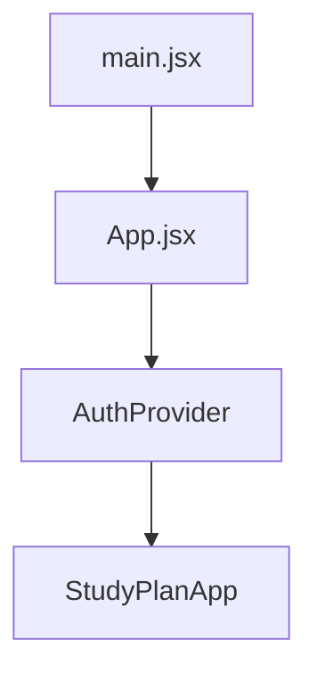

`StudyPlanApp` is the live shell for the product.

---

## High-Level UI Structure

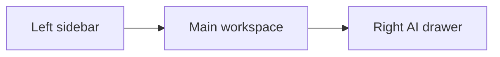

The key live views are:
- Calendar
- Plan History
- Settings
- Knowledge Graph modal
- Profile modal
- Session checklist modal
- Chat drawer

---

## Main Component Tree

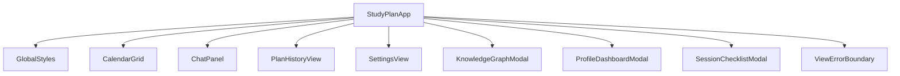

`StudyPlanApp` is the state hub.

It owns:
- loaded plans
- active plan
- draft plan preview
- external calendar blockers
- current tab
- AI drawer visibility
- AI drawer width
- thread id

---

## Data Flow In `StudyPlanApp`

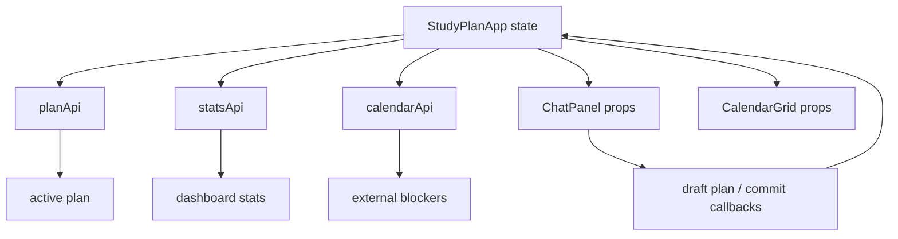

Main page hydration uses:
- `planApi.getActive()`
- `planApi.listAll()`
- `statsApi.dashboard()`
- `calendarApi.externalEvents(...)`

---

## Calendar View

`CalendarGrid.jsx` renders:
- day columns
- hour rails
- current time line
- external blockers
- SkedioAI sessions
- draft sessions

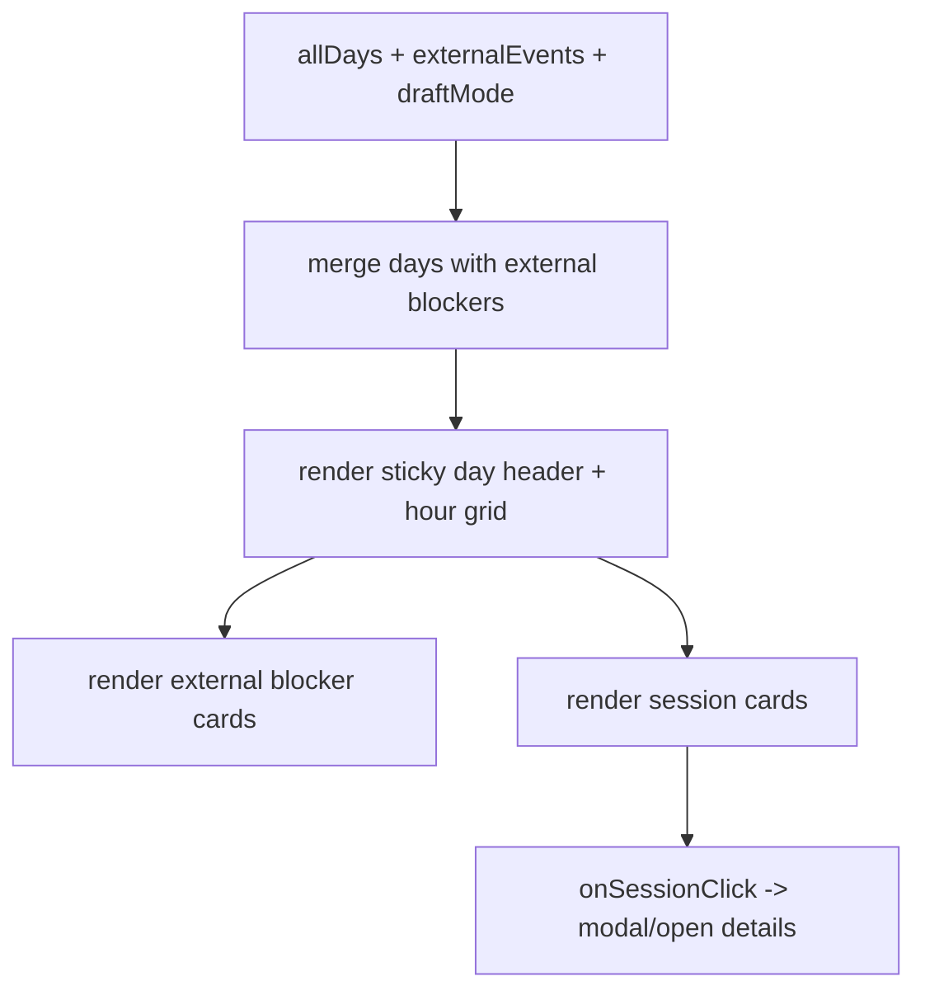

Important live behavior:
- external blockers are inserted into the same day columns
- draft sessions get a red “DRAFT” styling path
- completed/skipped sessions render differently from active ones

---

## Chat Drawer

`ChatPanel.jsx` is the live AI interaction surface.

It owns:
- local message list for the thread
- input box
- request-changes mode
- action button handling
- streaming reply assembly

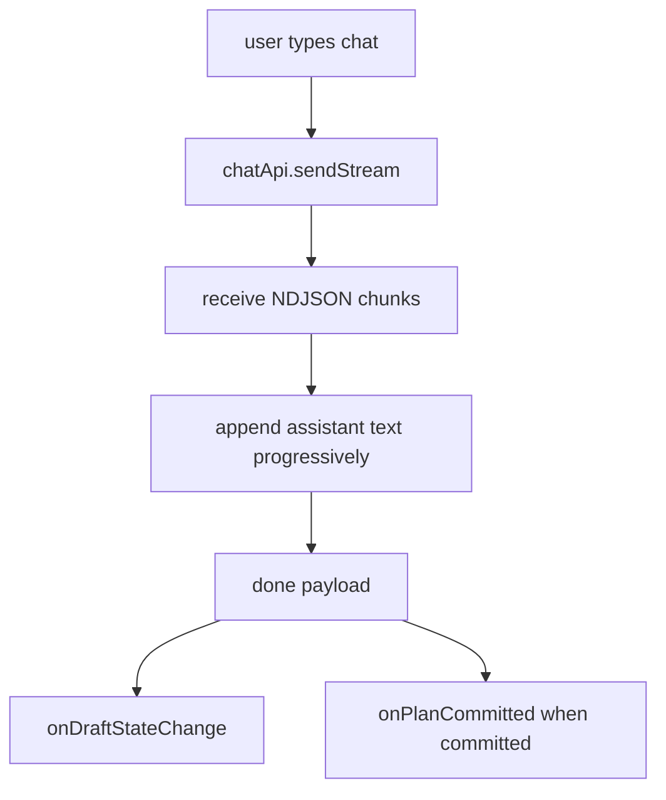

---

## Draft Review UI Flow

This is the most important current frontend behavior.

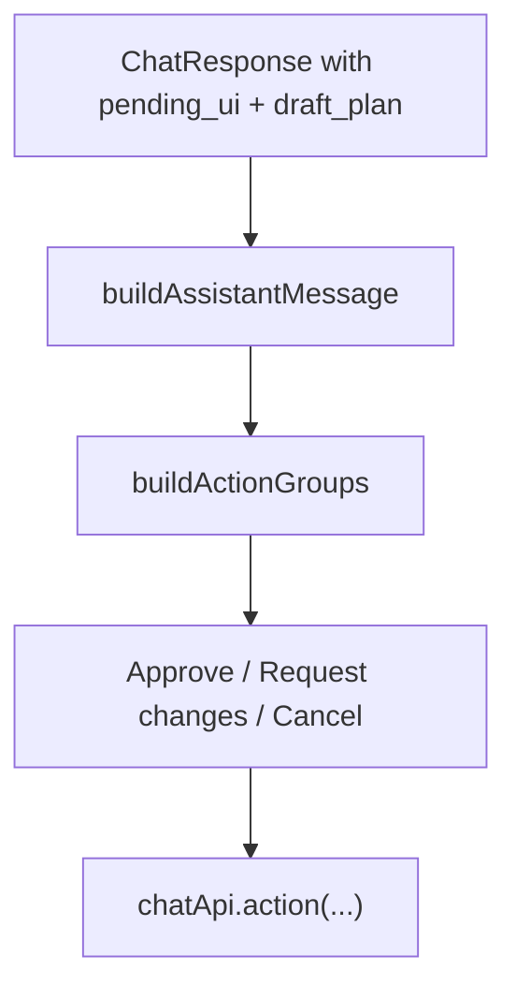

Important rule:

```text
The frontend does not guess review actions.
It renders structured actions from backend payload.
```

---

## Draft Plan Overlay Flow

`StudyPlanApp` chooses:

```text
visiblePlan = draftPlan || plan
```

That means:
- when backend returns a draft, the calendar can preview it immediately
- when committed or cleared, the app falls back to the durable active plan

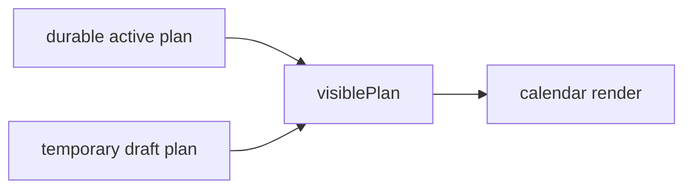

---

## Client API Layer

The frontend API wrappers are simple and separated by domain:

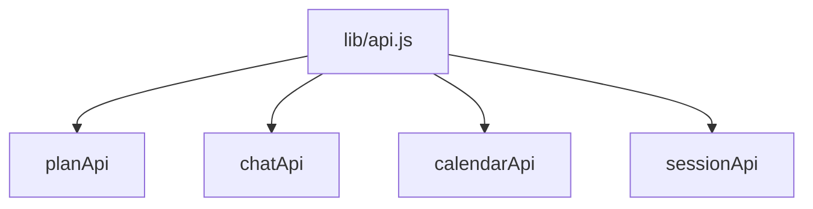

### `api.js`

Base helpers:
- `authFetch`
- timeout wrapper
- GET/POST helpers
- JSON/error helpers
- query-string builder

### `planApi`

- get active plan
- list plans
- allocation summary

### `chatApi`

- send normal chat
- send stream
- send UI action

### `calendarApi`

- status
- connect URL
- disconnect
- external blockers

### `sessionApi`

- complete session
- update content status
- undo session
- skip session

---

## Streaming Chat Flow

The streaming chat path is:

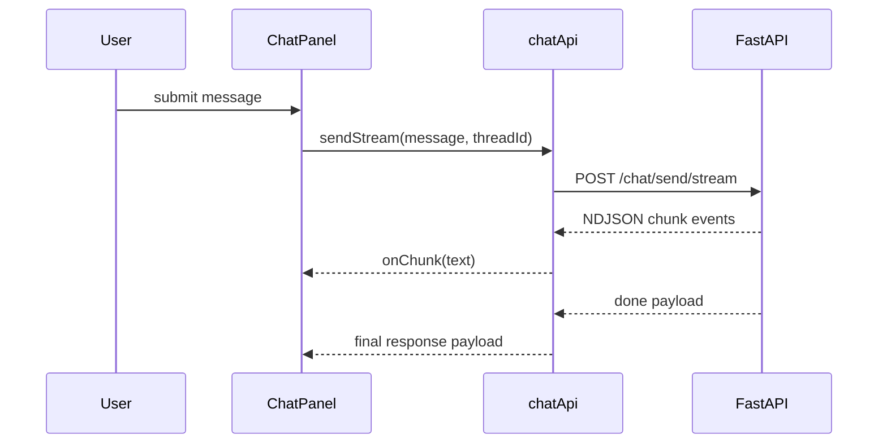

The final payload may contain:
- `reply`
- `plan_committed`
- `actions`
- `draft_plan`
- `pending_ui`

---

## Dev Preview Path

The current frontend has a local preview harness for draft-plan review UI.

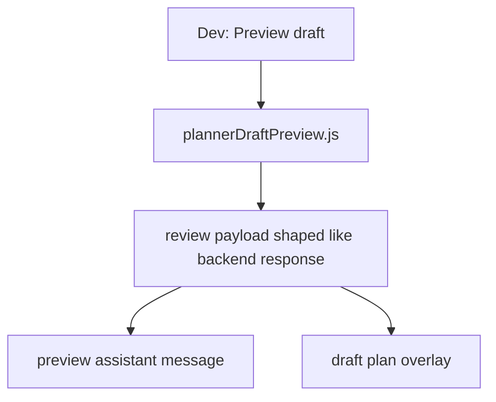

This is useful for iterating on UI without running the full agent flow.

---

## Most Important Surfaces To Read

If you are debugging the frontend, read in this order:

1. `src/components/StudyPlanApp.jsx`
2. `src/components/ChatPanel.jsx`
3. `src/components/CalendarGrid.jsx`
4. `src/lib/chatApi.js`
5. `src/lib/planApi.js`
6. `src/lib/calendarApi.js`
7. `src/lib/sessionApi.js`

That usually tells you whether the bug is:
- state ownership
- chat payload handling
- calendar rendering
- or API integration
