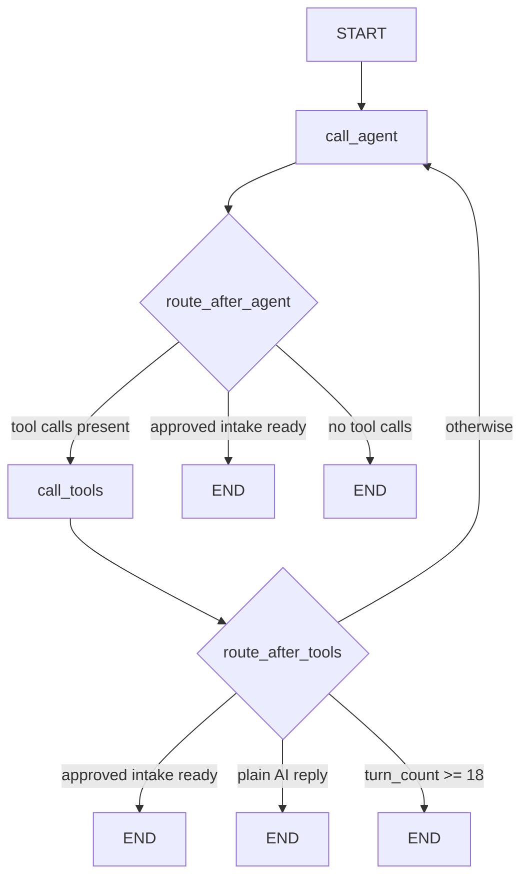
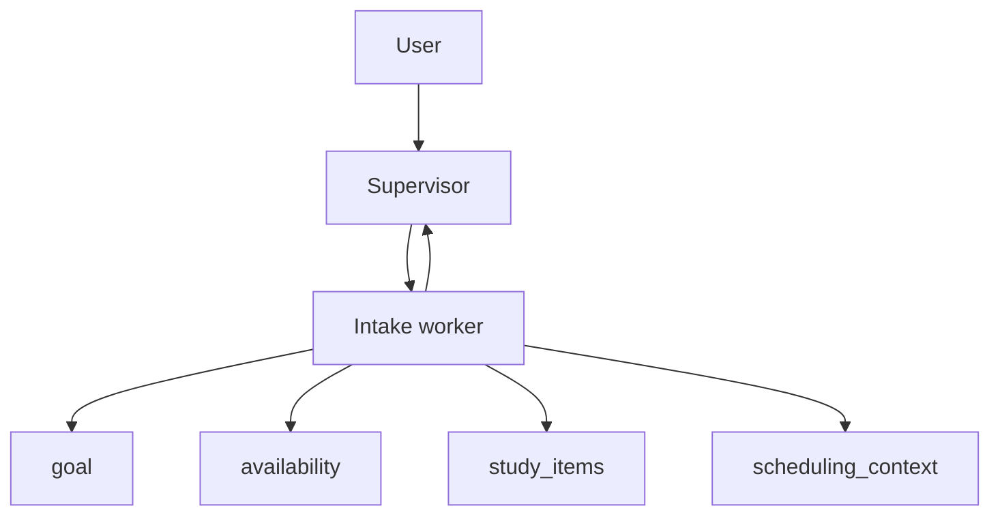
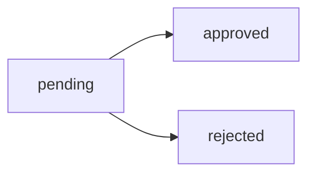
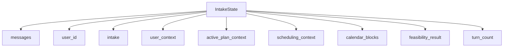
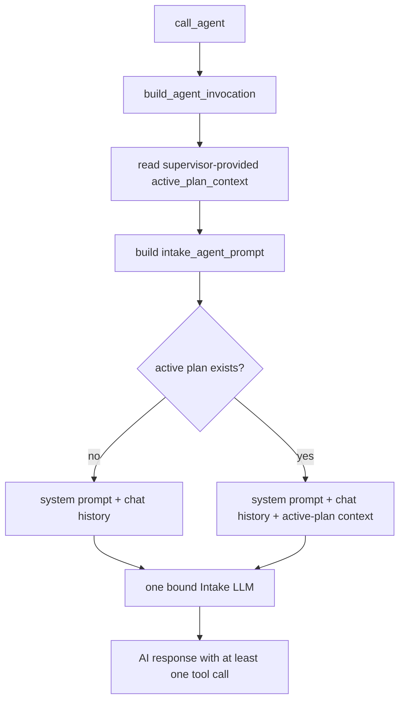
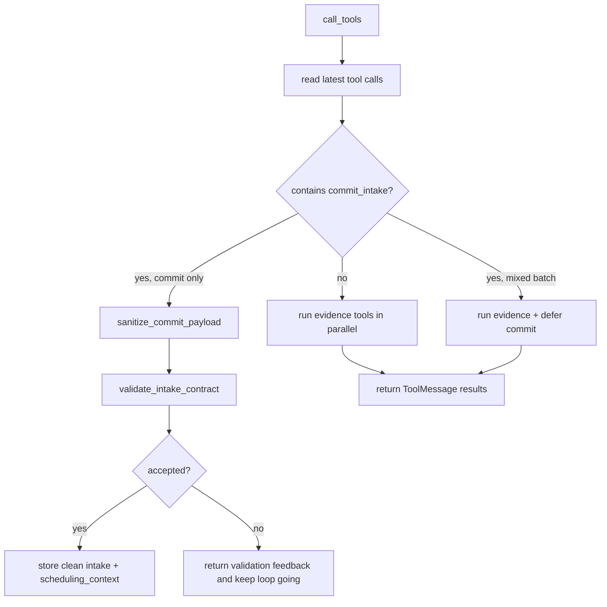
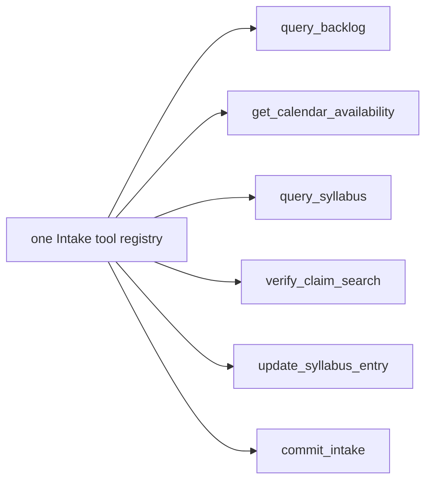
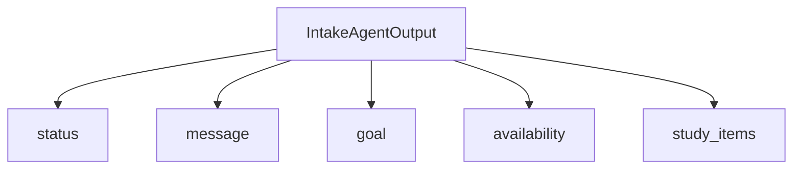
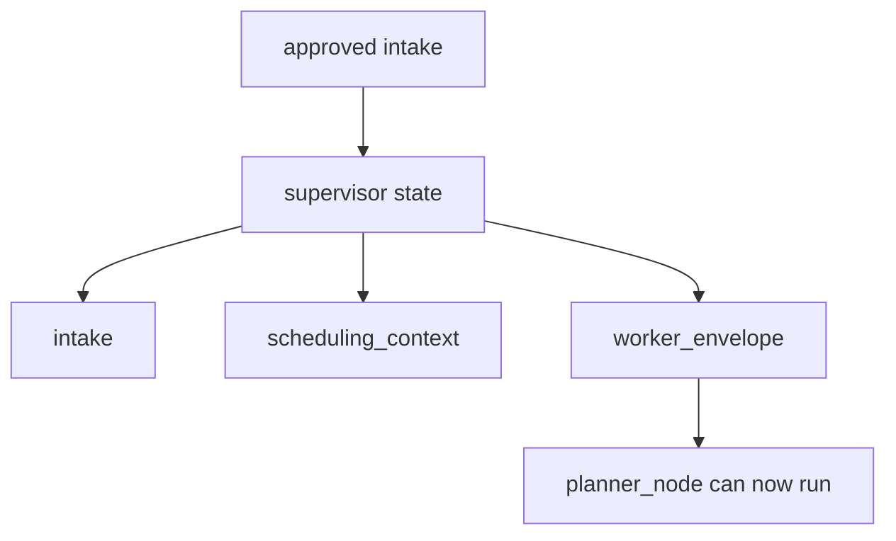

# Intake Agent Diagram

This document maps `src/agents/intake_agent.py` as it exists now.

## High-Level Intake Loop



## Ownership Boundary



Intake owns:
- contract facts
- evidence gathering
- validation handoff
- planner-ready intake output

Intake does not own:
- timed session drafting
- schedule placement
- plan commit

## Live Status Values



Current meanings:
- `pending`
  - still collecting or repairing facts
- `approved`
  - planner handoff is ready
- `rejected`
  - current request could not be accepted as-is

## Current Inputs



`IntakeState` no longer contains an action/mode field. Runtime truth determines
whether Intake is forming a first contract or maintaining the contract behind
an active plan.

## `call_agent`



Current prompt boundary:

```text
There is now one canonical runtime prompt vessel:
`intake_agent_prompt`.

Active-plan truth changes the extra runtime context sent to Intake, not which
runtime prompt file gets selected. Intake no longer does a hidden fallback
`get_active_plan` fetch inside the agent invocation path.
```

`tool_choice="required"` requires at least one tool call. Evidence tools may run
first; the graph loops back so `commit_intake` can checkpoint the contract.

## `call_tools`



The validator is the state authority, not raw model prose.

## Tool Categories



Current live intake tools are:
- `query_backlog`
- `get_calendar_availability`
- `query_syllabus`
- `verify_claim_search`
- `update_syllabus_entry`
- `commit_intake`

Important rule:

```text
Intake owns contract evidence and contract acceptance.
It does not reach for old planner-side helper tools to imitate scheduling.
```

## Output Shape



Planner handoff requires:
- `status = approved`
- valid `goal`
- valid `availability`
- valid `study_items`

## Supervisor Handoff



That is the current handoff contract between intake and planner.
Intake approval can hand the same work forward to Planner, but it does not mean
the final study plan is approved. Planner still drafts, verifies, and sends the
draft to user-facing review before any later commit.
