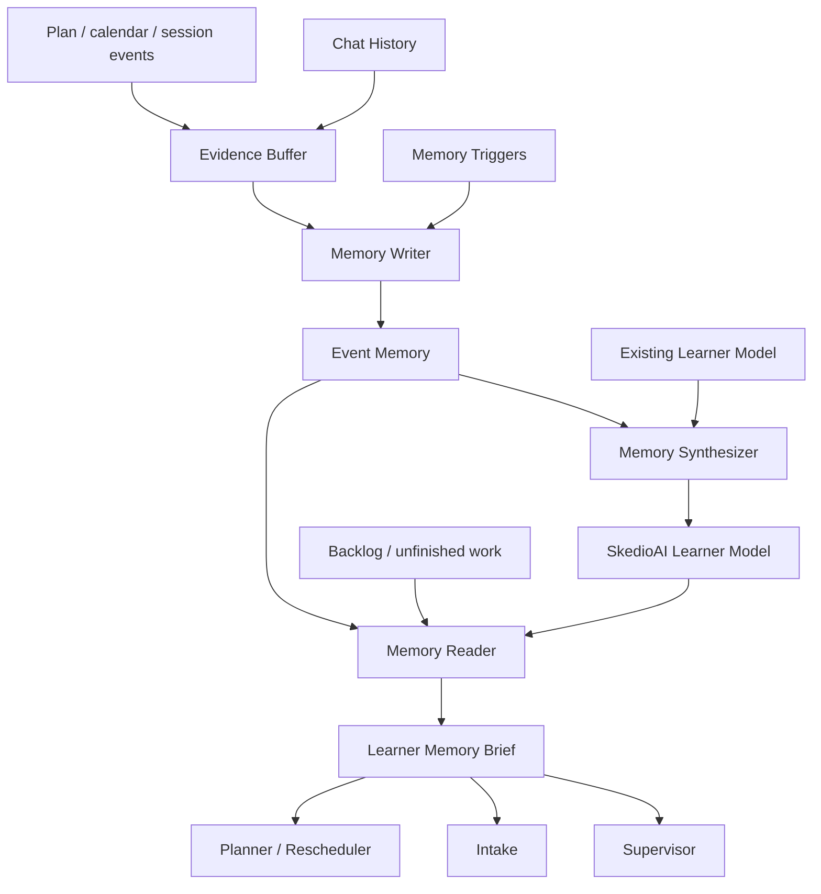
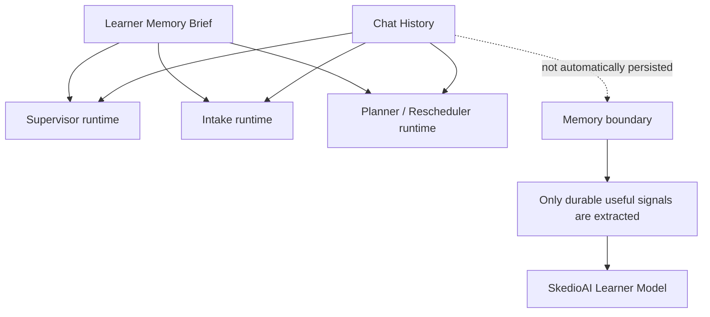
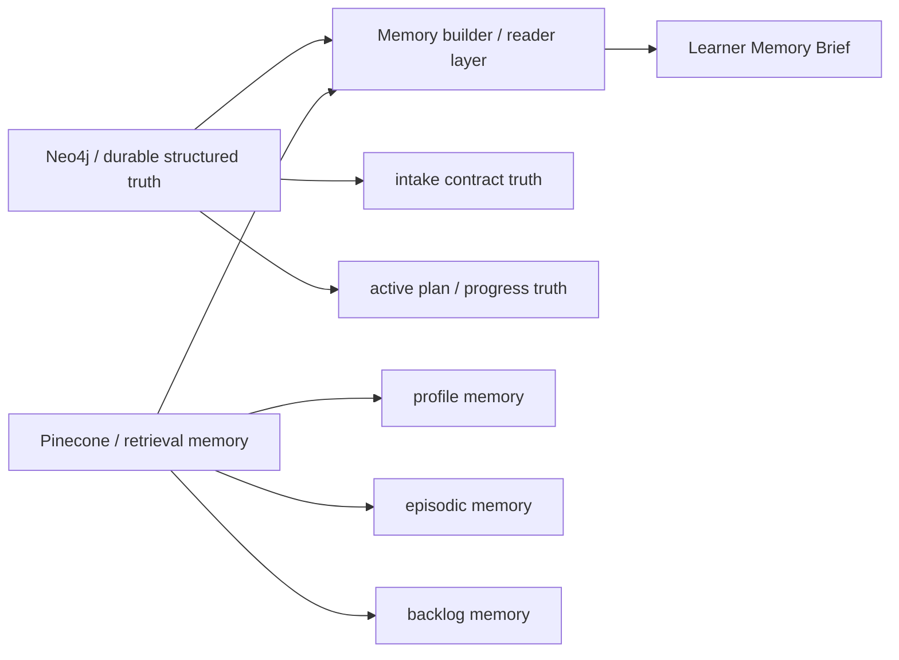
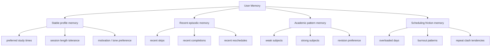
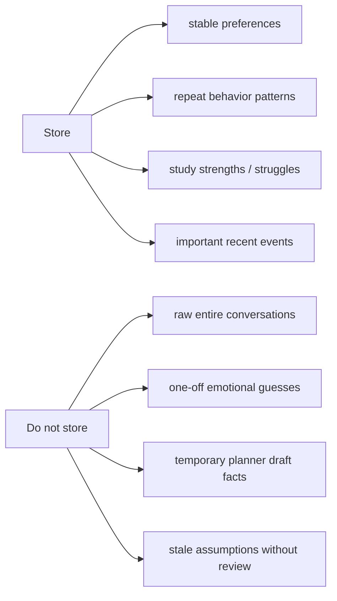
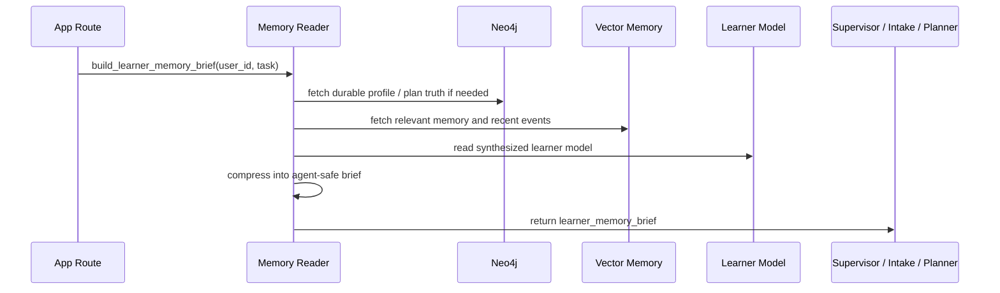
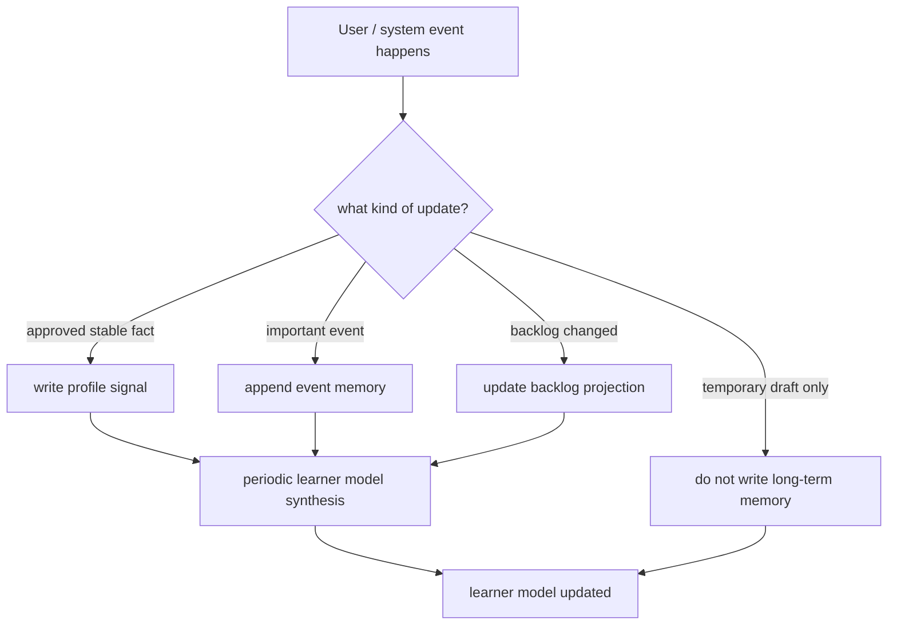
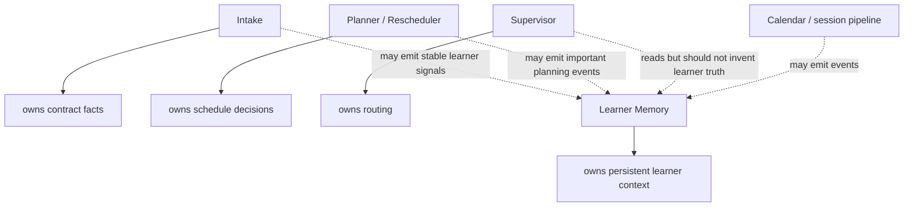
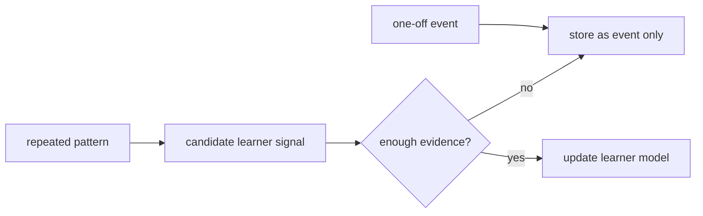

# SkedioAI Learner Memory Diagram

This document shows the proposed v1 learner memory architecture for SkedioAI.

This is not a small patch on top of the existing vector store.

The intended product concept is:

```text
SkedioAI Learner Model
```

The learner model is the controlled product brain that helps SkedioAI understand
the student across sessions.

It is not "remember everything forever."

The goal is:
- preserve useful learner continuity
- avoid stale memory poisoning
- keep planner/intake/supervisor grounded
- prevent raw chat history from becoming fake truth
- make the product feel personally aware without becoming creepy or overconfident

---

## Core Role

The learner model should help the product remember:

- stable learner preferences
- repeated behavior tendencies that matter for planning
- weak/strong subjects
- recurring scheduling friction
- recent important study events

Mental model:

```text
Chat history is not memory.
Memory is distilled, useful, persistent learner context.
```

The product should feel like:

```text
SkedioAI knows how this student studies.
```

It should not feel like:

```text
SkedioAI is storing every random sentence forever.
```

---

## Product Brain Shape



This is the main v1 idea:

```text
chat history is saved every turn
-> important triggers pick useful evidence
-> memory writer records durable memory only when useful
-> synthesizer updates the learner model conservatively
-> reader builds a short useful brief
-> agents use the brief
```

Important rule:

```text
Every turn can be chat history.
Every turn should not become learner memory.
```

First implemented trigger:

```text
plan accepted
-> episodic plan evidence is written
-> learner-memory synthesis is scheduled if OPENAI_API_KEY is available
-> accepted plan still succeeds if memory is skipped or fails
```

Second implemented trigger:

```text
session completed / partial / skipped / ticked / unticked
-> Neo4j progress truth is updated
-> backlog is synced
-> episodic progress evidence is written
-> complete/partial/subtopic outcomes count toward periodic synthesis
-> skipped sessions trigger immediate synthesis because they are high-signal friction
-> progress update still succeeds if memory is skipped or fails
```

Third implemented trigger:

```text
meaningful chat turn
-> cheap structural gate counts only non-trivial user messages
-> every 10th meaningful turn runs chat memory review
-> extractor decides whether there is durable learner memory or nothing
-> normal chat reply still succeeds if review is skipped or fails
```

---

## Runtime Context vs Memory



Chat history is still useful runtime context.

But chat history should not automatically become long-term memory.

---

## Memory Layers

```mermaid
flowchart TB
    LearnerModel["SkedioAI Learner Model"]
    LearnerModel --> Profile["Profile Memory"]
    LearnerModel --> Academic["Academic Memory"]
    LearnerModel --> Behavior["Behavior Memory"]
    LearnerModel --> Event["Event Memory"]

    Profile --> P1["grade / board / stable learner facts"]
    Profile --> P2["study preferences"]
    Profile --> P3["communication / motivation tone"]

    Academic --> A1["weak subjects"]
    Academic --> A2["strong subjects"]
    Academic --> A3["revision style"]
    Academic --> A4["backlog patterns"]

    Behavior --> B1["overcommit tendency"]
    Behavior --> B2["skip / reschedule pattern"]
    Behavior --> B3["fatigue pattern"]
    Behavior --> B4["session length tolerance"]

    Event --> E1["plan created"]
    Event --> E2["session missed"]
    Event --> E3["reschedule accepted"]
    Event --> E4["exam week / important milestone"]
```



---

## Source-of-Truth Split



Meaning:

- Neo4j holds structured product truth
- vector memory can hold retrieval-friendly learner memory
- the learner model is the product-level contract
- the runtime builder returns a short agent-ready brief

Existing storage is allowed to change.

The design should not be limited by the current memory files.

---

## Memory Buckets



These buckets are conceptual.

They do not have to map one-to-one to current files.

---

## What We Store vs What We Do Not Store



This is a major safety boundary.

---

## Learner Memory Brief

Agents should receive memory as a short operational brief, not as raw database
or vector-store dumps.

Example:

```text
=== LEARNER MEMORY BRIEF ===
- Class 10 student.
- Usually handles 2-3 focused sessions per day better than many tiny scattered sessions.
- Recent issue: evening Science sessions were missed after tuition-heavy days.
- Academic pattern: Biology backlog is active; Chemistry numericals need slower placement.
- Planning implication: place harder topics earlier on lighter days when possible.
```

The brief should be:
- short
- evidence-based
- useful for the current agent
- clear about tendencies vs hard constraints

---

## Runtime Read Flow



---

## Write Flow



Memory updates should be conservative.

One skipped session should not become a personality trait.

Repeated evidence can become a planning tendency.

---

## Ownership Boundary



---

## Conservative Update Rule



Bad memory:

```text
Skipped Maths once -> hates Maths.
```

Good memory:

```text
Late-night Maths sessions were missed 3 times in 4 weeks.
Planning implication: avoid heavy Maths late unless user asks.
```

---

## Recommended v1 Rule

```text
Memory should remember what helps future planning,
not everything the user ever said.
```

That means v1 should focus on:
- stable preferences
- recurring study behavior
- academic struggle/strength patterns
- recent important events
- recurring scheduling friction

and avoid:
- raw full-chat memory
- hidden personality overreach
- planner draft leakage into long-term memory
- treating weak evidence as a rule

V1 should optimize for:
- useful continuity
- student trust
- planning quality
- simple debuggability
