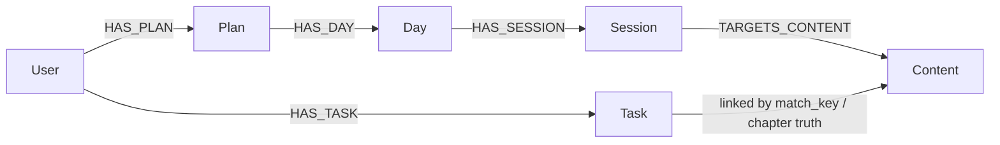
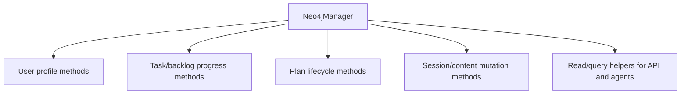
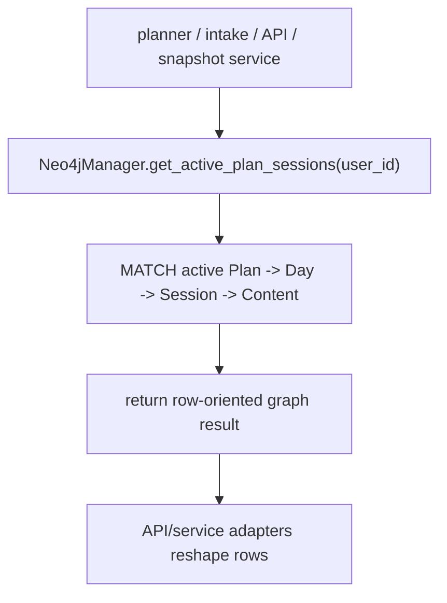
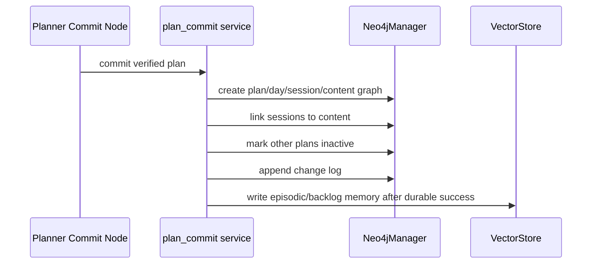
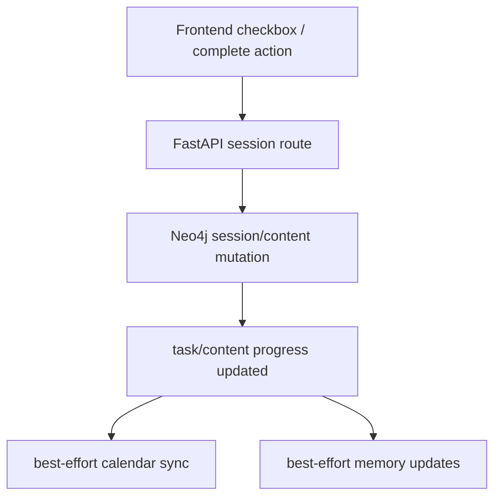
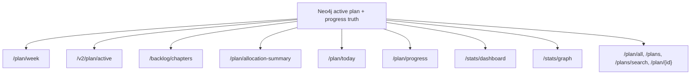
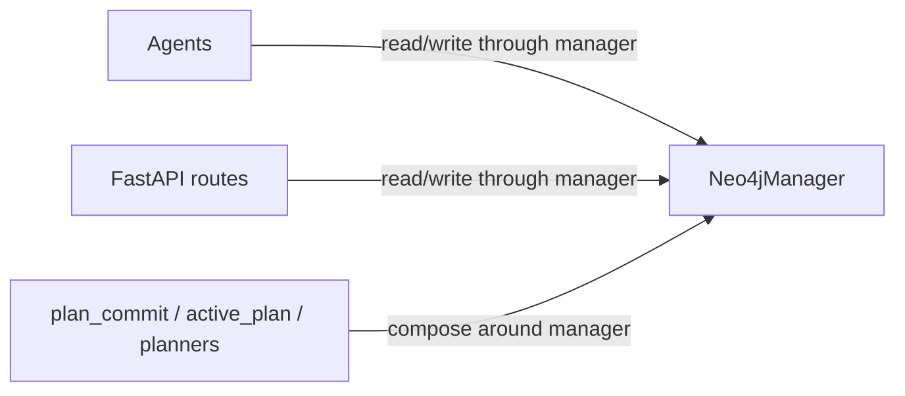

# Neo4j Diagram

This document maps `src/database/neo4j.py` as it exists now.

It is the structured source of truth for SkedioAI.

It is current live truth for durable structured study state.

Use this file when you want to understand:
- where active plan truth comes from
- how sessions/content/checkmarks are persisted
- what the API and agents read from Neo4j
- how progress and plan lifecycle mutations actually work

---

## Core Role

`Neo4jManager` is the durable graph wrapper for:
- users
- tasks
- plans
- days
- sessions
- content

Mental model:

```text
Neo4j = authoritative structured study state
VectorStore = retrieval-oriented memory derived from durable truth
Agents/API = callers of the Neo4j manager, not alternate persistence owners
```

---

## High-Level Data Model



At a practical level:
- `Task` tracks backlog/progress-style chapter truth
- `Plan -> Day -> Session -> Content` tracks the active schedule
- session/content edges carry completion state and time spent

---

## Main Responsibilities



### User profile methods

- `create_user`
- `get_user_model`
- `update_user_model`

### Task/progress methods

- task creation and lookup
- user task listing
- task-progress reconciliation against session truth
- chapter and backlog progress helpers

### Plan lifecycle methods

- `create_plan`
- active-plan reads
- `get_plan_by_id`
- `mark_plan_inactive`
- `mark_all_plans_inactive`
- `mark_other_plans_inactive`
- `list_plans_paginated`
- `search_plans_by_date`
- `update_plan_name`
- `update_plan_fields`
- `set_plan_actual_end_date`
- `append_to_change_log`

### Session/content methods

- `create_content`
- `resolve_content`
- `create_session`
- `create_session_with_day_link`
- link sessions to content
- session completion
- session reset / reopen
- session skip
- content tick / untick
- per-content time updates

Important note:

```text
This section describes the live responsibility groups.
Method names have evolved over time, so this diagram intentionally prefers
stable behavior categories over older low-level method inventories.
```

---

## Active Plan Read Path

The most important live read path is:

- `get_active_plan_sessions(user_id)`

It is used by:
- planner tools
- intake tools
- API endpoints
- active-plan snapshot builders



Returned row shape includes:
- plan metadata
- `work_item_targets`
- `work_item_hours_spent`
- `intake_snapshot`
- day fields
- session fields
- content arrays
- completed content keys

This is the main “live plan truth” surface in the system.

---

## Plan Creation / Commit Path

The planner does not write raw Cypher directly.

Instead:



Important rule:

```text
Neo4j commit succeeds first.
Vector memory updates come after.
```

---

## Session Completion Path

When the user marks work done, the durable path is:



Typical mutations touch:
- session status
- content edge status
- content time spent
- task-level hours/progress

---

## API Read Paths Built On Neo4j

These route groups depend heavily on Neo4j:



Those endpoints mostly:
- fetch raw plan rows
- regroup them into frontend-friendly JSON
- compute aggregate status

The durable truth still starts in Neo4j.

---

## V1 vs V2 Reality

This file currently contains mixed generations of methods.

Practical split:

### Older style

- task-oriented helpers
- older plan helpers
- session/task bridging methods

### Newer style

- active plan session/content queries
- `*_v2` content tick/complete/reset methods
- chapter backlog derived from plan/content truth

This is why the file is large:

```text
SkedioAI is mid-migration from older task/session shapes to the newer
Plan -> Day -> Session -> Content model.
```

---

## Most Important Surfaces To Understand

If you are debugging product behavior, read these first:

1. `get_active_plan_sessions`
2. `create_plan`
3. `mark_other_plans_inactive`
4. `complete_session_v2`
5. `tick_content_v2`
6. `untick_content_v2`
7. `get_chapter_backlog_v2`

Those are the highest-signal methods for:
- current plan truth
- commit flow
- completion flow
- chapter backlog derivation

---

## Read vs Write Ownership



Good rule:

```text
If the state is structured and durable, the correct question is:
"Which Neo4jManager method owns this?"
```

Bad rule:

```text
"Let the agent infer or rebuild this from memory."
```

---

## Debugging Questions

When Neo4j-backed behavior looks wrong, answer these in order:

1. Which route/agent called Neo4j?
2. Which manager method was used?
3. Was this a read-path bug or a write-path bug?
4. Did the raw active-plan rows already contain the bad truth?
5. Did the bug happen during regrouping/adaptation after Neo4j?
6. Did a later best-effort sync fail while Neo4j itself succeeded?

That usually tells you whether the issue is:
- persistence
- adapter logic
- calendar sync
- or vector-memory follow-up
