# Planner Agent Diagram

This document maps the current live planner architecture.

The main live simplification is:
- one Planner agent owns both first-time plan creation and later schedule revision
- Intake owns contract facts
- Planner owns schedule creation and schedule revision
- verify and commit stay deterministic around Planner

## High-Level Flow

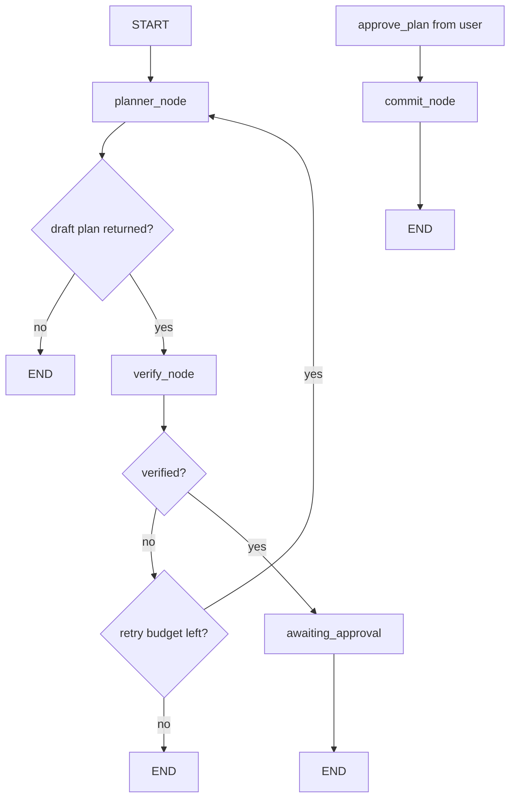

The practical interpretation is:

- planner drafts a schedule
- deterministic verification checks it
- frontend previews it
- user approval decides whether commit happens

That preview step is important.
The planner is not directly mutating the durable active plan on first output.

## Ownership Boundary

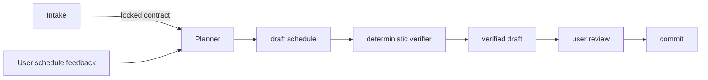

Planner owns:
- making the first usable schedule
- revising an existing schedule
- handling schedule-shape feedback
- preparing a draft for verification
- staying inside schedule ownership instead of re-opening contract questions by itself

Planner does not own:
- collecting core contract facts
- changing subjects, scope, deadline, or feasibility rules by itself
- final UI messaging

## Mental Model

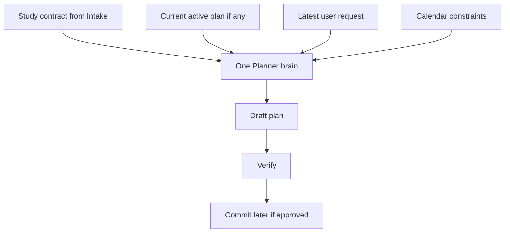

The Planner decides like this:
- no active plan yet -> create the first schedule
- active plan exists + user wants timing/workload changes -> revise that schedule
- active plan exists + user request changes contract facts -> hand off back to Intake

That split is one of the most important live product boundaries.

## Planner State

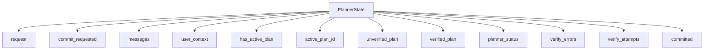

The live simplification is:
- no split planner personalities in the state
- commit is the only explicit special command
- runtime truth decides whether planner is creating or revising

## Planner Entry Logic

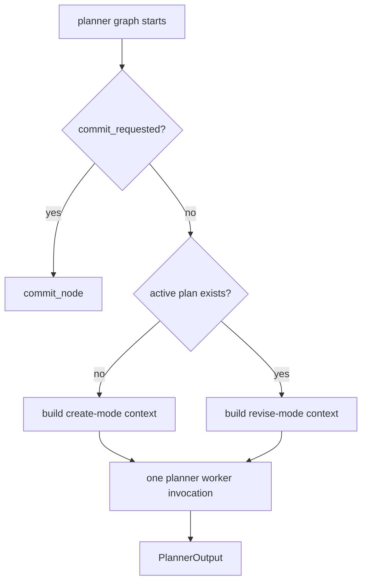

Important idea:

```text
one normal planner code path
+ different runtime context
+ same ownership boundary
+ one explicit commit path
```

This keeps the system easier to reason about than a pile of planner sub-agents with overlapping jobs.

## Planner Node

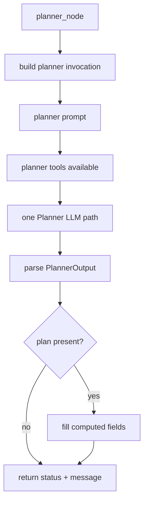

The live behavior is:
- one planner invocation path
- one planner tool boundary
- one visible planner output contract
- one draft object the frontend can preview before approval

## Tool Boundary

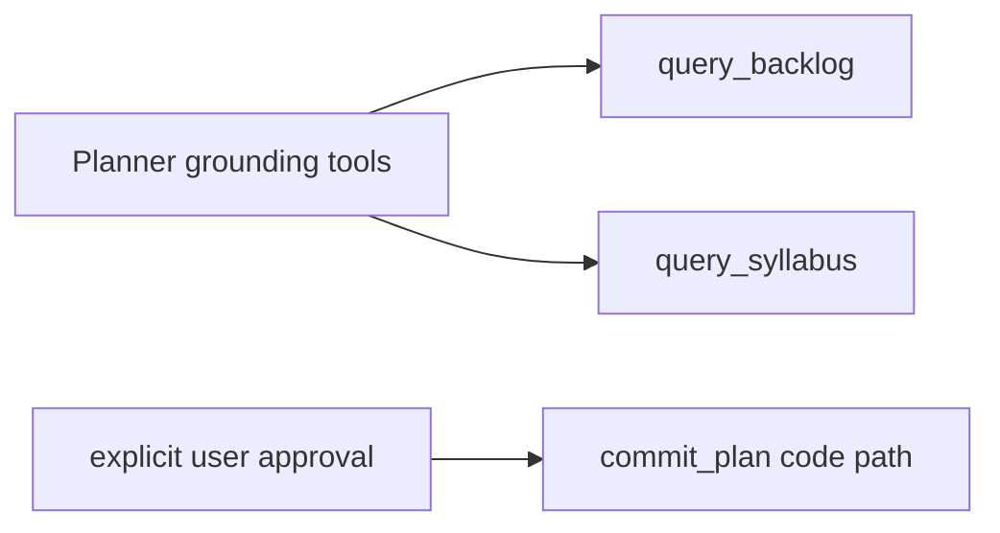

Typical usage:
- `query_backlog`
  - only when the locked contract lacks enough learner-progress detail for concrete session content
- `query_syllabus`
  - when official topic names, removed topics, active topics, or weightage matter
- commit path
  - only after explicit user approval and deterministic verification

Calendar truth is passed in planner context.
Planner should not fetch calendar data during normal draft generation.

## Verification Path

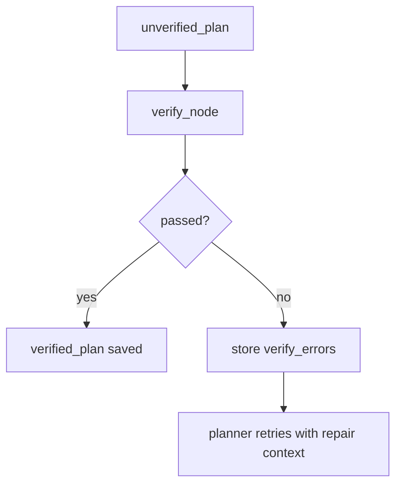

Meaning:
- `unverified_plan`
  - planner has proposed a schedule
- `verified_plan`
  - deterministic checks accepted that schedule
- `awaiting_approval`
  - safe draft is ready for user review

Frontend consequence:

```text
visiblePlan = draftPlan || activePlan
```

So the user can see the draft in calendar form before it becomes durable truth.

Verifier currently checks:
- full date coverage, including empty days
- session time math and no past/current-time sessions
- daily capacity and total-hour accounting
- available windows
- commitments and calendar blockers
- same-day session overlaps
- deadline cutoff
- locked study-item allocations
- valid content match keys

## Commit Path

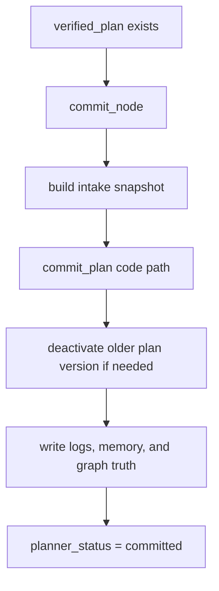

Commit should stay deterministic and boring.

That is good.

## Intake vs Planner Split

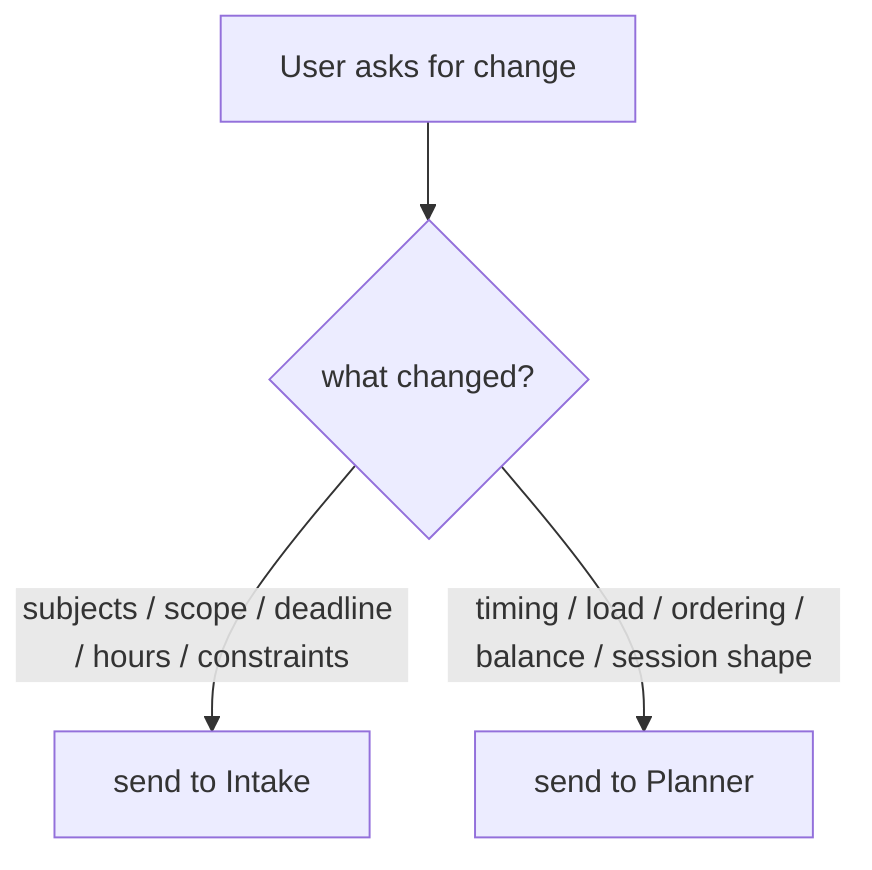

This is the current live boundary.

## Review Path

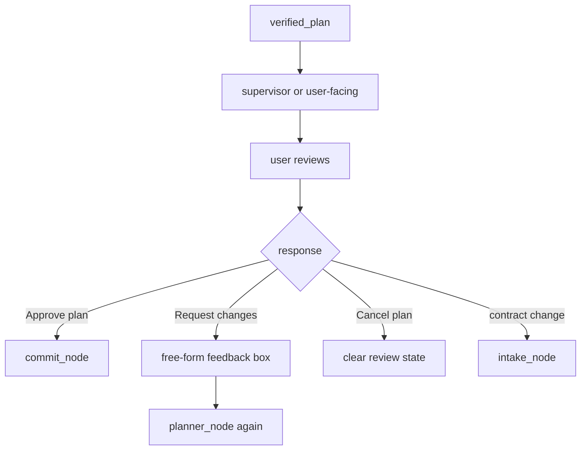

The Planner does not generate review-option buttons.

The UI owns the review actions:

```text
Approve plan
Request changes
Cancel plan
```

That keeps interaction affordances in frontend ownership and scheduling truth in planner ownership.

## Output Contract

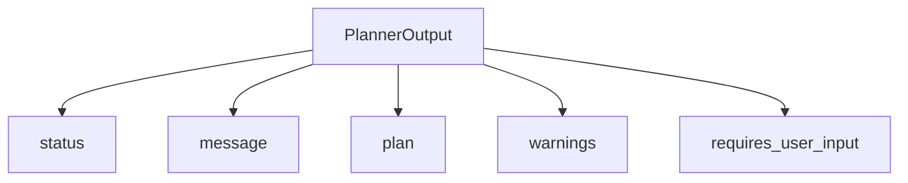

Top-level intent of the output:
- return a usable draft
- or ask for missing schedule-side clarification
- or fail cleanly

## Canonical Lifecycle

```text
Intake approves contract
-> Planner drafts schedule
-> Verifier checks it
-> User reviews it
-> Planner commits it after approval
-> same Planner later revises that same plan when schedule-only changes happen
```

That is the current live planner lifecycle.
