This document maps `src/api/routes.py` as it exists now.

It is the main FastAPI surface between:
- React frontend
- supervisor/planner/intake runtime
- Neo4j
- calendar MCP

It is current live truth for backend runtime routing at the API layer.

---

## Core Role

`routes.py` does 5 big jobs:
- app lifecycle and middleware
- plan/progress/session endpoints
- chat/supervisor endpoints
- calendar blocker access
- dashboard/stats aggregation

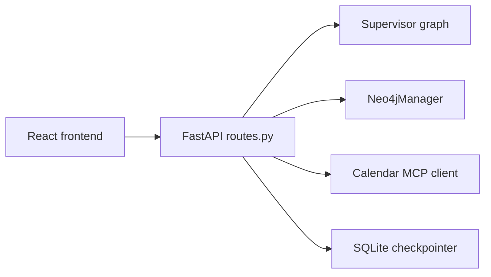

---

## App Startup Flow

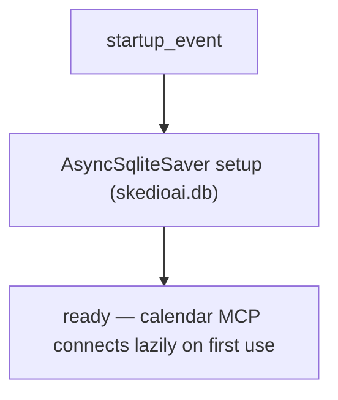

At shutdown:

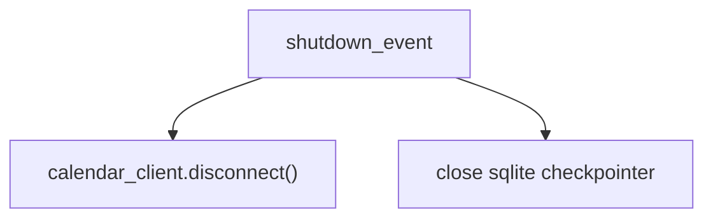

---

## Route Families

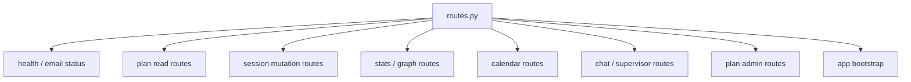

---

## Plan Read Routes

Main endpoints:
- `/plan/week` — full active plan grouped by day
- `/plan/active` — same as /plan/week (alias)
- `/plan/today` — today's sessions only
- `/plan/progress` — task-level progress (hours completed vs total)
- `/plan/allocation-summary` — chapter targets vs scheduled/completed
- `/plan/all` — all plans paginated (used by frontend)
- `/plan/{plan_id}` — fetch any plan by ID
- `/plans` — all plans paginated (unused by frontend, kept for API completeness)
- `/plans/search` — search plans by date range
- `/backlog/chapters` — chapter-level backlog

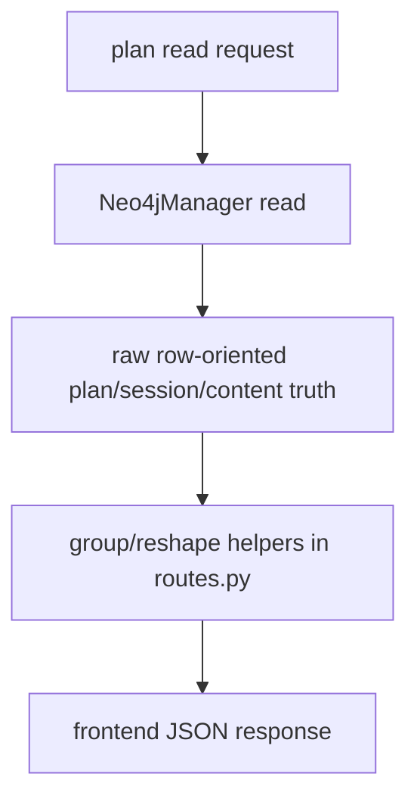

Important helpers:
- `_group_plan_by_day`
- `_allocation_targets_from_raw`
- `_build_progress_from_grouped_plan`
- `_build_dashboard_stats_from_raw`

These are adapter-layer helpers, not source-of-truth generators.

---

## Session Mutation Routes

Main endpoints:
- `/session/complete`
- `/session/undo`
- `/session/untick`
- `/session/tick-subtopic`
- `/session/skip`

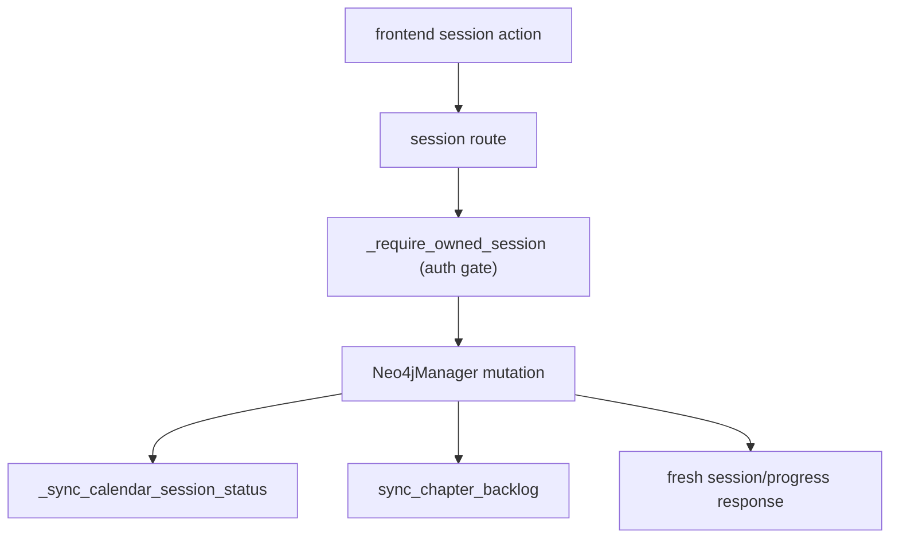

Important behavior:
- Neo4j mutation is the main state change
- calendar sync is best-effort follow-up
- `_require_owned_session` ensures session belongs to authenticated user

---

## Dashboard / Stats Routes

Main endpoints:
- `/stats/dashboard` — hours, progress, topic breakdown
- `/stats/graph` — Obsidian-style knowledge graph (User→Subject→Chapter→Content)

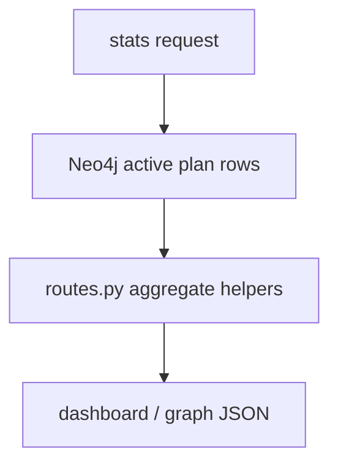

Subtopic counts use `neo.get_subtopic_counts()` (Neo4jManager method).

---

## Calendar Routes

Main endpoints:
- `/calendar/events/external` — fetch non-SkedioAI blockers
- Conditionally mounted: `calendar_webhook` (when `ENABLE_CALENDAR_WEBHOOKS=1`)

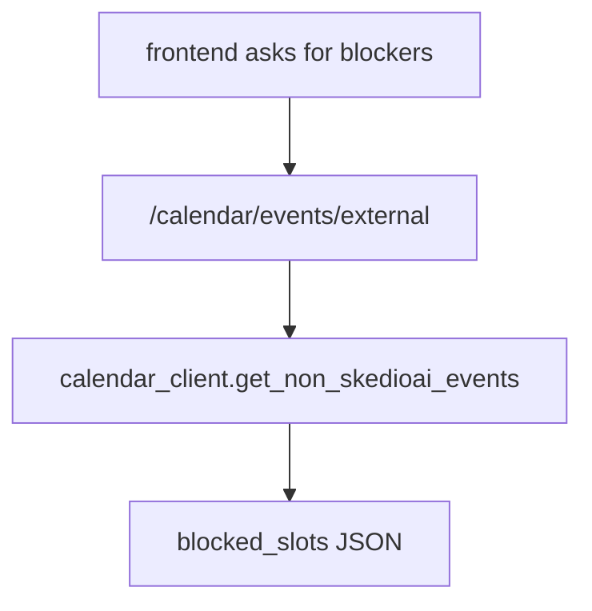

Other OAuth calendar routes are mounted from:
- `src.api.calendar_oauth`

---

## Chat Route Family

Main endpoints:
- `/chat/send` — one-shot chat
- `/chat/send/stream` — streaming chat (NDJSON)
- `/chat/action` — structured UI action (approve/reject/cancel)
- `/chat/reset/{thread_id}` — clear conversation history

These are the most important routes for agent orchestration.

### Normal chat

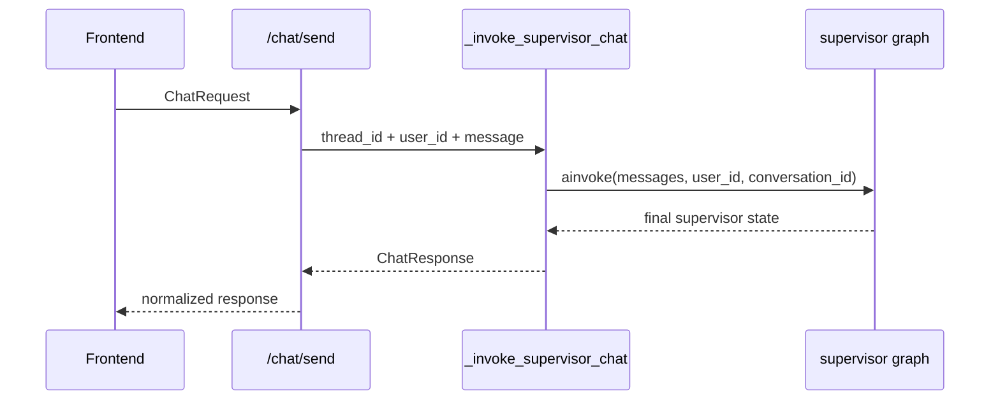

### Streaming chat

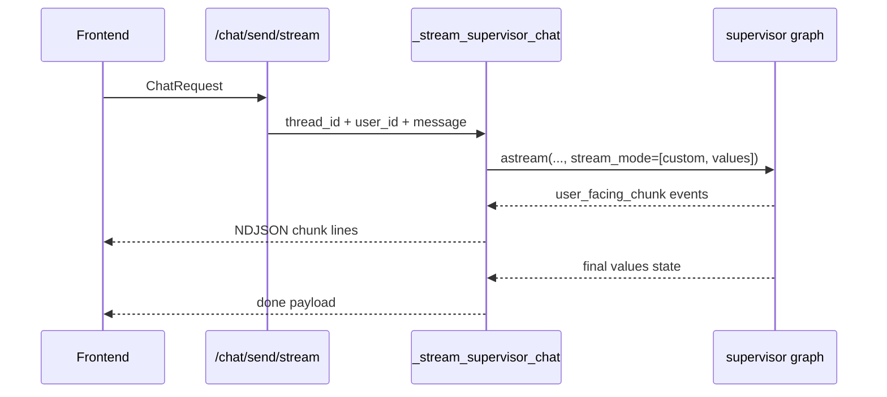

### Structured UI action

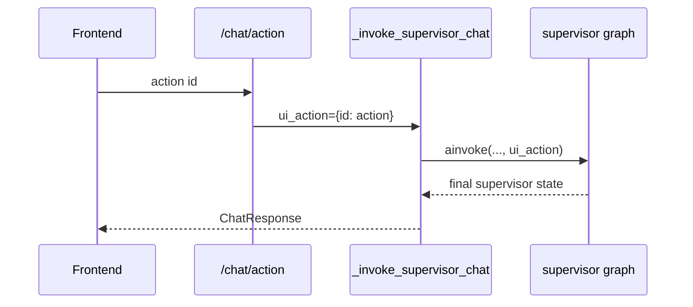

Important rule:

```text
UI actions are sent structurally.
The route no longer needs to fake normal chat for approval/cancel buttons.
```

---

## Plan Admin Routes

Main endpoints:
- `/plan/delete` — mark active plan as DELETED + delete calendar events via MCP
- `/plan/mark-inactive` — mark active plan as INACTIVE (triggers lobby deportation)
- `/plans/{plan_id}` PATCH — update plan metadata (currently only plan_name)

---

## App Bootstrap

Main endpoint:
- `/app/bootstrap` — single boot payload combining plan, progress, and stats

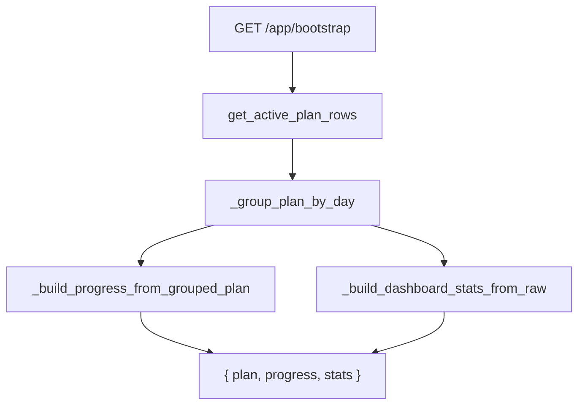

---

## Supervisor Integration

The chat helpers are thin wrappers around the supervisor graph.

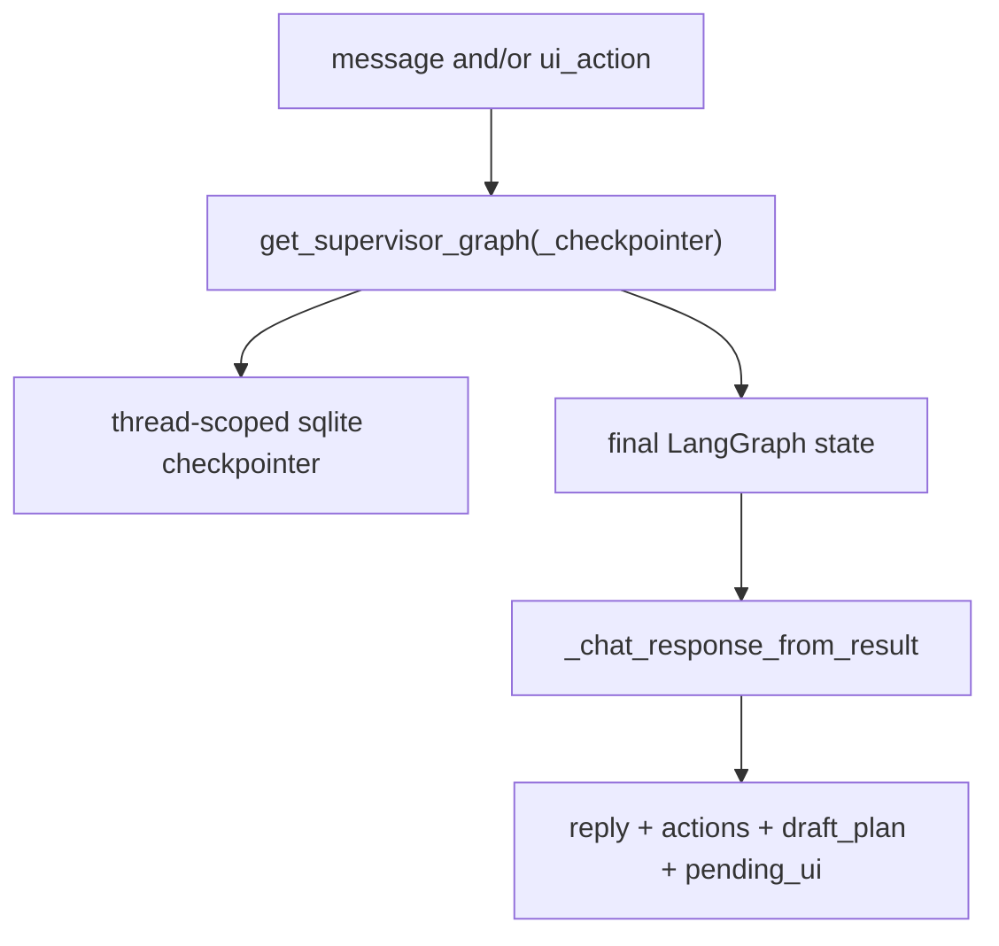

This normalization step is critical because it bridges:
- raw LangGraph state
- frontend chat contract

---

## Main Helpers In This File

High-signal helpers:

- `_scoped_thread_id`
  - namespaces conversation threads per authenticated user
- `_require_owned_session`
  - authorization gate for session mutation routes
- `_chat_response_from_result`
  - maps supervisor result into frontend response contract
- `_sync_calendar_session_status`
  - mirrors session completion into calendar
- `_group_plan_by_day`
  - groups raw plan rows into day → session → content shape
- `_build_progress_from_grouped_plan`
  - builds progress payload from grouped plan
- `_build_dashboard_stats_from_raw`
  - builds dashboard stats from raw plan rows
- `_build_workspace_bootstrap`
  - composite payload builder for /app/bootstrap
- `_invoke_supervisor_chat`
  - one-shot supervisor call
- `_stream_supervisor_chat`
  - streaming supervisor call

---

## Main Response Contracts

Important request/response models:

```mermaid
flowchart TB
    ChatRequest["ChatRequest"]
    ChatActionRequest["ChatActionRequest"]
    ChatResponse["ChatResponse"]
    ChatActionOption["ChatActionOption (id, label)"]
    SessionComplete["SessionCompleteRequest"]
    SessionContent["SessionContentUpdate"]
    SessionSkip["SessionSkipRequest"]
    SessionUndo["SessionUndoRequest"]
    TickSubtopic["TickSubtopicRequest"]
    UntickSubtopic["UntickSubtopicRequest"]
    PlanUpdate["PlanUpdateRequest"]
```

`ChatResponse` currently carries:
- `thread_id`
- `reply`
- `phase`
- `plan_committed`
- `actions` — list of `ChatActionOption(id, label)`
- `draft_plan`
- `pending_ui`

That is the key bridge between backend agent state and frontend review UI.

---

## Debugging Questions

When route behavior is wrong, ask:

1. Did the frontend hit the correct endpoint?
2. Did the route call Neo4j, calendar, or supervisor?
3. Did the raw backend result already contain the bad truth?
4. Did `_chat_response_from_result` reshape it incorrectly?
5. Was the issue in the route, or in the lower layer it called?

Good practical split:

- wrong persistence data -> Neo4j/service issue
- wrong chat payload -> routes normalization issue
- wrong streaming behavior -> `_stream_supervisor_chat`
- wrong button behavior -> `/chat/action` + `ui_action` path
