# Supervisor Routing Diagram

This document maps `src/agents/supervisor_slop.py` as it exists now.

It is the live truth for:
- routing
- worker handoff
- review-state handling
- user-facing rendering after worker execution

Despite the filename, the runtime pattern is fairly disciplined:
- one supervisor
- one intake worker
- one planner worker
- one user-facing renderer

The supervisor is not a planner and not an intake fallback brain.
Its job is to decide who owns the next move.

## High-Level Flow

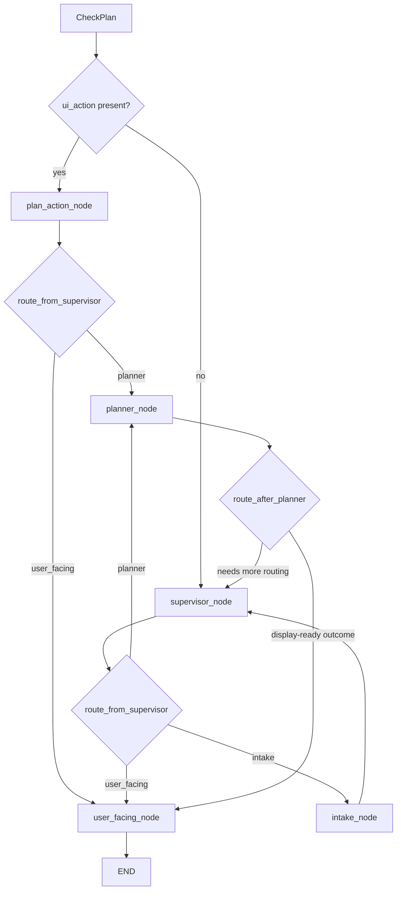

## Ownership Boundary

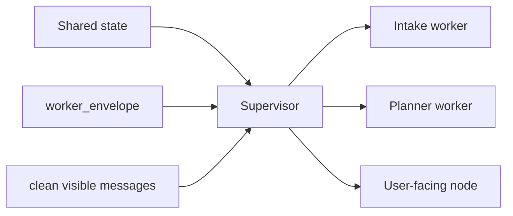

Supervisor owns:
- routing
- worker handoff
- `pending_ui`
- structured UI actions
- review-action interpretation
- turn-level worker result storage through `worker_envelope`

Supervisor does not own:
- intake contract generation
- plan drafting
- verification
- commit
- rewriting worker ownership boundaries on the fly

## Current State Shape

```mermaid
flowchart TB
    State["SupervisorState"]

    State --> Messages["messages"]
    State --> UserId["user_id"]
    State --> HasPlan["has_active_plan"]
    State --> PlanId["active_plan_id"]
    State --> PlanContext["active_plan_context"]
    State --> Intake["intake"]
    State --> Scheduling["scheduling_context"]
    State --> PlannerStatus["planner_status"]
    State --> Verified["verified_plan"]
    State --> Committed["committed"]
    State --> PendingUI["pending_ui"]
    State --> UIAction["ui_action"]
    State --> Envelope["worker_envelope"]
    State --> Outcome["worker_outcome"]
    State --> Hops["worker_hops_this_turn"]
    State --> FinalReply["final_reply"]
```

## `check_plan_node`

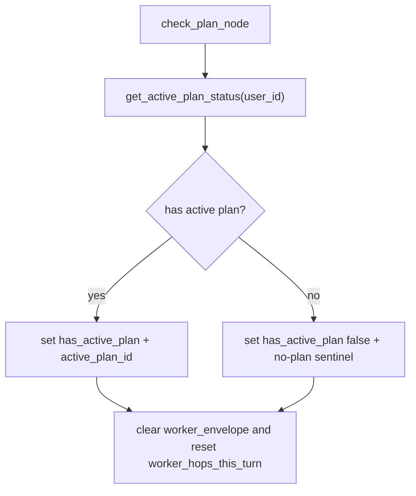

## `plan_action_node`

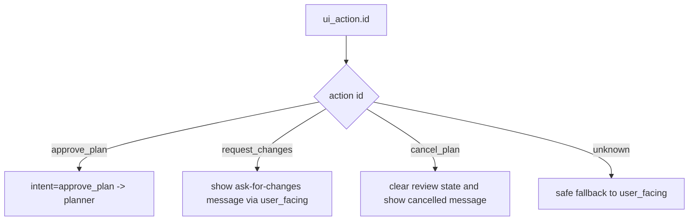

## `supervisor_node`

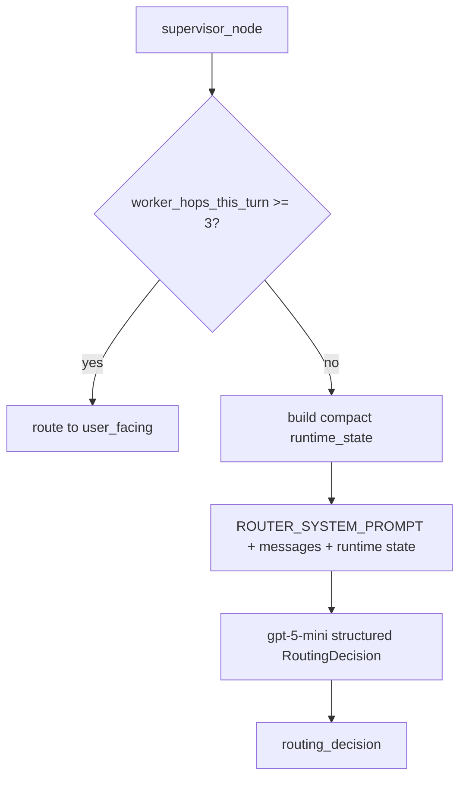

The router sees:
- clean visible `messages`
- `contract_ready`
- `plan_verified`
- `plan_committed`
- latest `worker_envelope`

Current routing ideology:
- `has_active_plan` is context, not the main decider
- user intent drives the next worker
- worker ownership decides whether intake or planner should act
- the supervisor should prefer explicit state over conversational guesswork

## `intake_node`

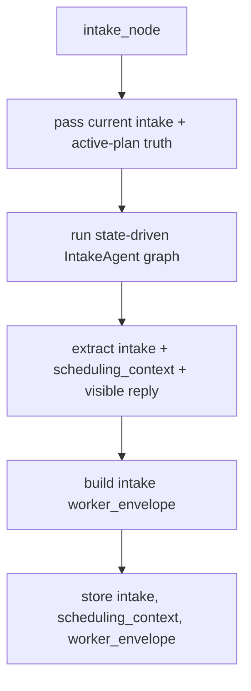

The supervisor no longer chooses an Intake action/mode. For users without an
active plan it passes the already-known no-plan result, avoiding a duplicate
lookup. For active-plan users, Intake loads the complete progress snapshot it
needs to maintain the contract.

## `planner_node`

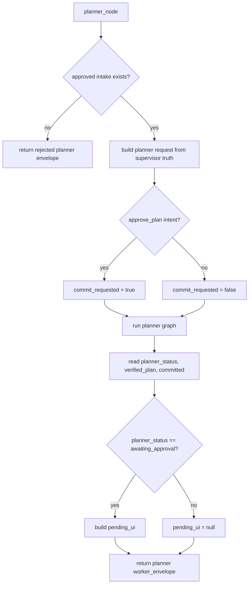

Rule:
- commit is the only explicit planner command
- `has_active_plan` provides the create-vs-revise runtime truth
- `awaiting_approval`, `committed`, `needs_input`, `rejected`, and `escalate`
  route directly to `user_facing_node` after Planner
- a verified draft created in this turn is shown before any approval decision is
  made in a later turn

This is the important product behavior:

```text
draft now
review now
approve later
commit later
```

## `user_facing_node`

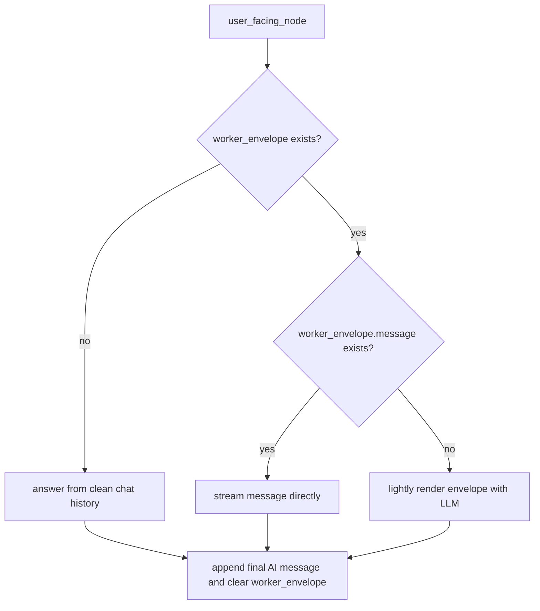

## Review UI Path

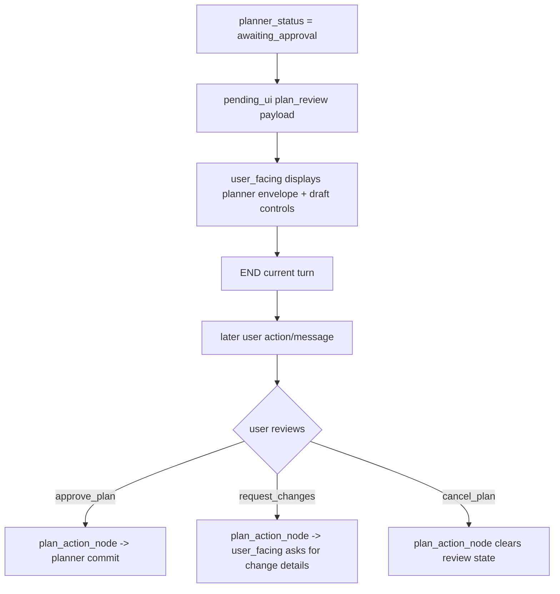

## Envelope Contract

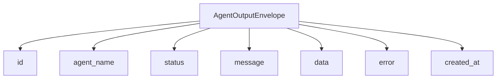

The supervisor routes from:
- shared state
- `worker_envelope`
- clean `messages`

Not from raw worker tool transcripts.

## Practical Summary

If you want one sentence for the whole file, use this:

```text
Supervisor decides the owner of the next turn, then gets out of the way.
```

That keeps the system from collapsing into one overpowered router prompt that
tries to think, validate, schedule, and render all at once.
