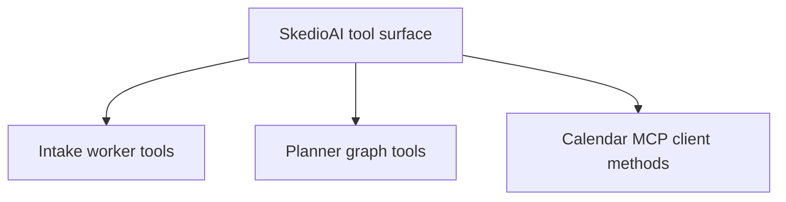
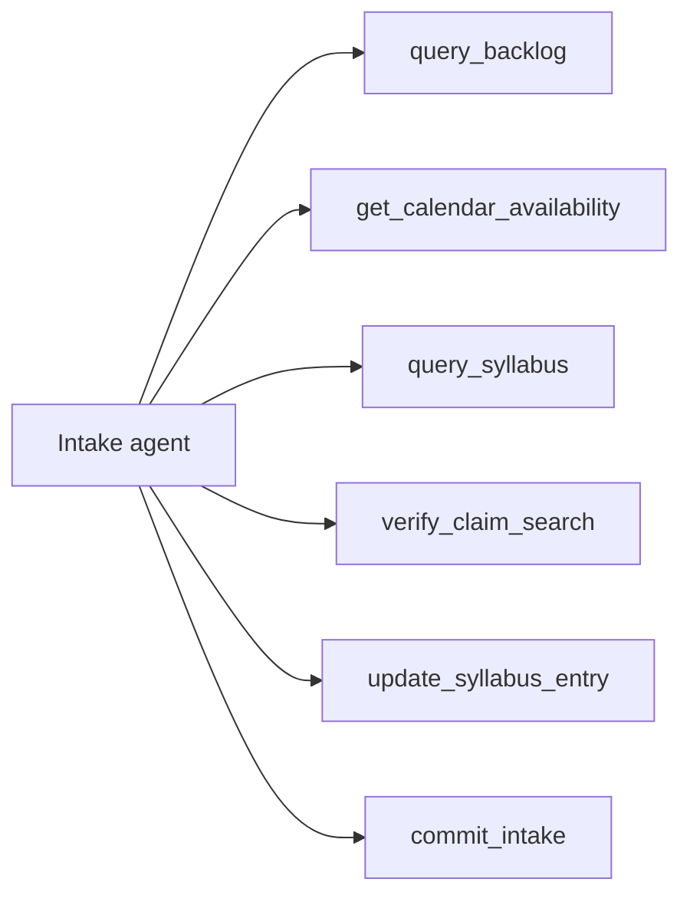
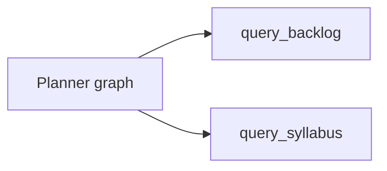
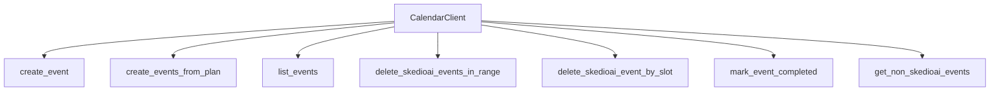
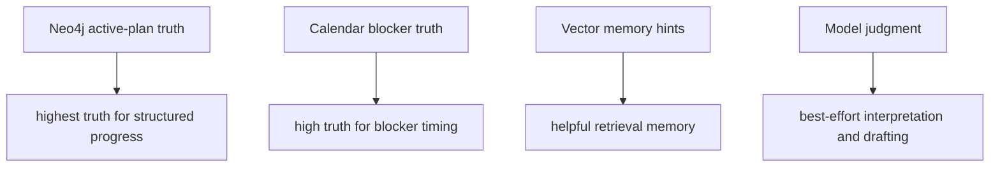

This document maps the main live tools used by SkedioAI's agent and runtime layers.

It focuses on tools that materially affect the current planning system:
- Intake tools
- Planner tools
- Calendar MCP methods

This is not every helper in the repo.
It is the active tool surface that changes runtime behavior.

---

## Tool Families



---

## Intake Tool Set

The current intake worker binds:

- `query_backlog`
- `get_calendar_availability`
- `query_syllabus`
- `verify_claim_search`
- `update_syllabus_entry`
- `commit_intake`



### `query_backlog`

Source:
- `src/agents/intake_agent.py`

Purpose:
- read learner-specific unfinished, weak, or completed topic memory

Backed by:
- `VectorStore.search_backlog`
- `VectorStore.get_all_backlog`

Use when:
- scope is vague
- pending or weak items matter
- estimated hours or remaining subtopics need grounding

Not authoritative for:
- current active-plan session truth

---

### `get_calendar_availability`

Source:
- `src/agents/intake_agent.py`

Purpose:
- fetch known Google Calendar blockers for a date window

Backed by:
- `src.tools.calendar_ops.get_non_skedioai_events_core`

Use when:
- date range is known
- feasibility or locking is about to be assessed

Important rule:

```text
Calendar blockers are evidence.
They do not automatically rewrite daily_study_hours.
```

---

### `query_syllabus`

Source:
- `src/agents/intake_agent.py`

Purpose:
- fetch official curriculum scope

Backed by:
- `VectorStore.search_syllabus`

Use when:
- subject-only request
- chapter ambiguity
- chapter suggestions
- scope grounding

Important rule:

```text
Syllabus says what exists academically.
Backlog says what this learner still needs.
```

---

### `verify_claim_search`

Source:
- `src/agents/intake_agent.py`

Purpose:
- do exceptional external verification when syllabus truth is meaningfully disputed

Important rule:

```text
This is not for ordinary planning.
Use local syllabus truth first.
```

---

### `update_syllabus_entry`

Source:
- `src/agents/intake_agent.py`

Purpose:
- rare syllabus correction path after strong enough verification

Important rule:

```text
This is a maintenance-style correction tool, not a normal planning tool.
```

---

### `commit_intake`

Source:
- `src/agents/intake_agent.py`

Purpose:
- force the agent through the contract gate every meaningful turn

Backed by:
- deterministic validation path inside the intake runtime

Important rule:

```text
The model can propose intake data.
Validation decides what becomes accepted intake state.
```

This is the most important intake tool.

---

## Planner Tool Set

The current planner graph binds:

- `query_backlog`
- `query_syllabus`



### `query_backlog`

Purpose:
- fetch learner-progress truth when schedule shaping needs stronger grounding

Backed by:
- vector backlog retrieval layer

Important rule:

```text
Backlog helps planner shape the work well.
It does not override intake contract ownership.
```

---

### `query_syllabus`

Purpose:
- fetch curriculum truth when exact topic legality or chapter grounding matters

Backed by:
- vector syllabus retrieval layer

Important rule:

```text
Planner should not invent topic structure when syllabus truth matters.
```

Planner does not normally fetch fresh calendar truth as an LLM tool.
Calendar blockers are expected to arrive through intake or runtime context, while
durable plan truth arrives through active-plan loading and commit logic around the planner.

---

## Calendar MCP Client Methods

The backend uses a shared MCP wrapper in `src/tools/test_mcp_client.py`.

Main methods:
- `create_event`
- `create_events_from_plan`
- `list_events`
- `delete_skedioai_events_in_range`
- `delete_skedioai_event_by_slot`
- `mark_event_completed`
- `get_non_skedioai_events`



These are not LLM tools in the same sense as intake and planner tools, but they
are part of the backend tool surface that planning depends on.

---

## Tool Truth Hierarchy

This is the most important conceptual diagram:



Practical reading:
- Neo4j beats chat claims
- calendar blockers beat guessed free time
- vector memory helps but does not override durable truth
- model judgment should be boxed in by these sources
