This document maps `src/database/vector_store.py` as it exists now.

It is not the structured source of truth.

It is the retrieval-oriented memory layer used to help agents remember:
- who the learner is
- what happened recently
- what remains unfinished
- what the syllabus says

---

## Core Role

The live vector store uses:
- Pinecone
- Gemini embeddings

Mental model:

```text
Neo4j stores durable graph truth.
VectorStore stores retrieval-friendly memory views.
```

This file should help you answer:
- what is stored in Pinecone
- what namespaces exist
- what gets overwritten vs appended
- what the agents should trust or not trust from vector memory

---

## Namespace Model

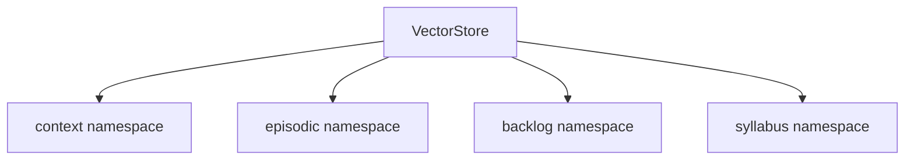

### `context`

Purpose:
- learner identity
- preferences
- struggles
- habits

Write rule:
- overwrite by category

Example:

```text
category=schedule
category=preference
category=struggle
```

### `episodic`

Purpose:
- append-only timeline of events

Write rule:
- always append

Examples:
- session complete
- plan created
- plan rescheduled
- skip
- behavior analysis

### `backlog`

Purpose:
- one memory entry per incomplete chapter/topic-style backlog item

Write rule:
- rewrite by `user_id + match_key`

### `syllabus`

Purpose:
- curriculum knowledge retrieval for intake and scope grounding

Write rule:
- upsert by `topic_key`

---

## Namespace Behavior Summary

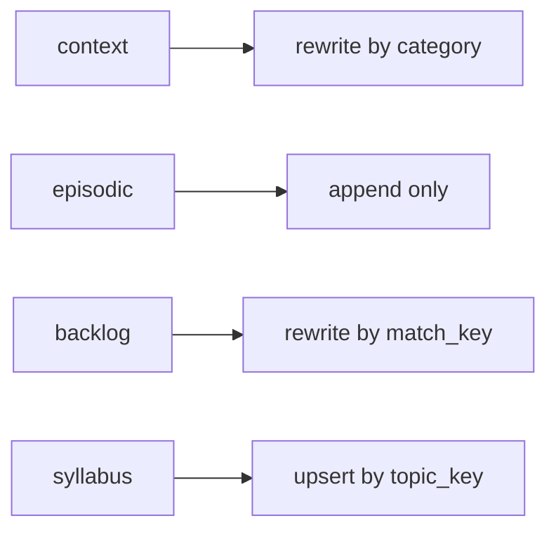

This is one of the most important invariants in the file.

---

## Data Flow

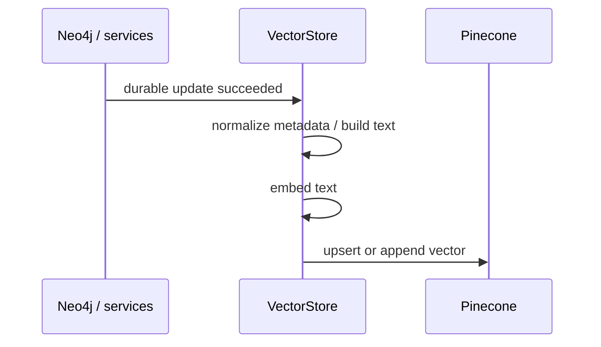

And for retrieval:

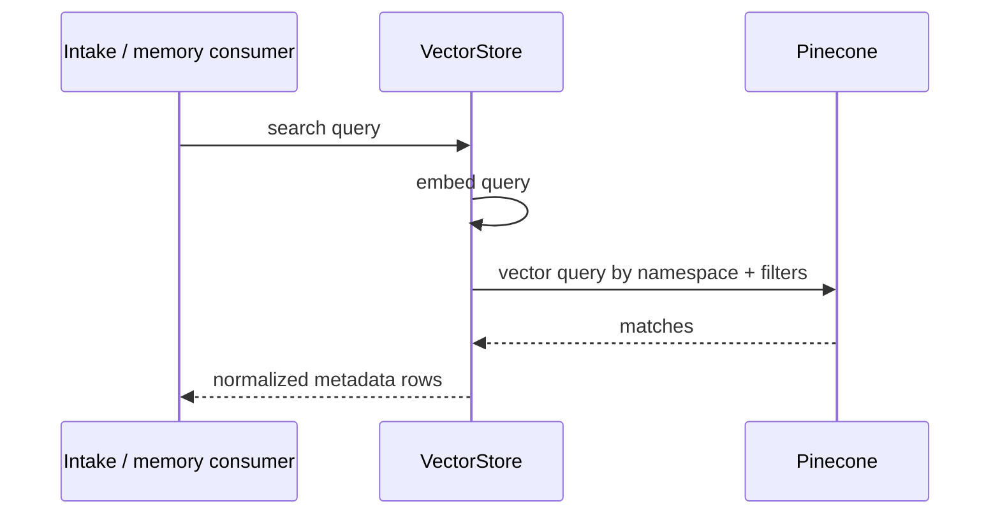

---

## Main Responsibilities

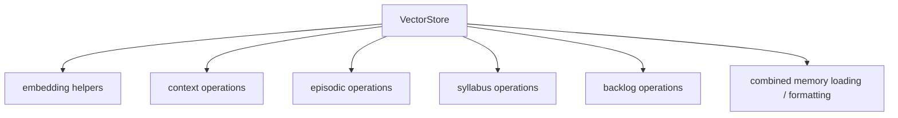

### Embedding helpers

- `embed`
- `embed_batch`

### Context operations

- `upsert_context`
- `search_context`
- `get_all_context`

### Episodic operations

- `log_event`
- `search_episodic`
- `get_recent_episodic`
- convenience loggers such as:
  - `log_session_complete`
  - `log_session_undo`
  - `log_plan_created`
  - `log_plan_snapshot`

### Syllabus operations

- `upsert_syllabus`
- `search_syllabus`
- `get_subject_summary`
- `syllabus_is_seeded`
- `format_syllabus_for_prompt`

### Backlog operations

- `upsert_backlog`
- `upsert_backlog_batch`
- `search_backlog`
- `search_backlog_sync`
- `get_all_backlog`
- `delete_backlog_entry`
- `backlog_entry_exists`

### Combined memory loading

- `load_full_memory`
- `format_memory_for_prompt`

---

## Context Memory Flow

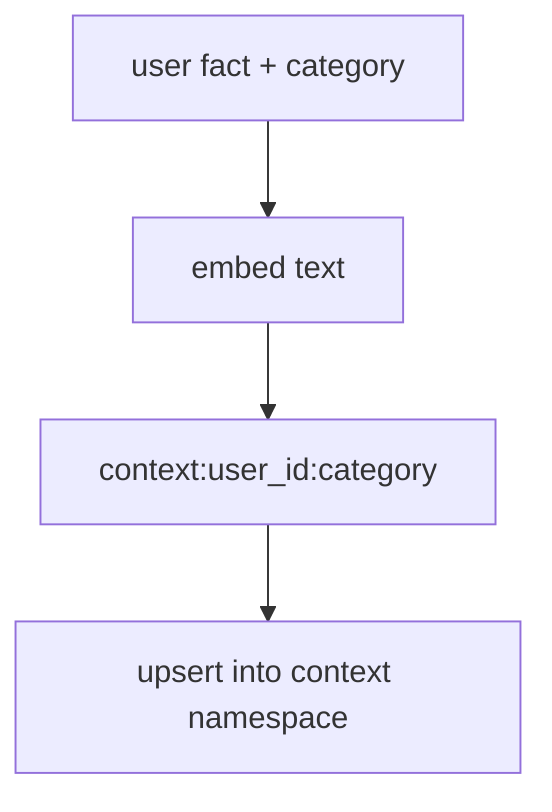

Important rule:

```text
Context should stay compact.
It is identity memory, not a log dump.
```

---

## Episodic Memory Flow

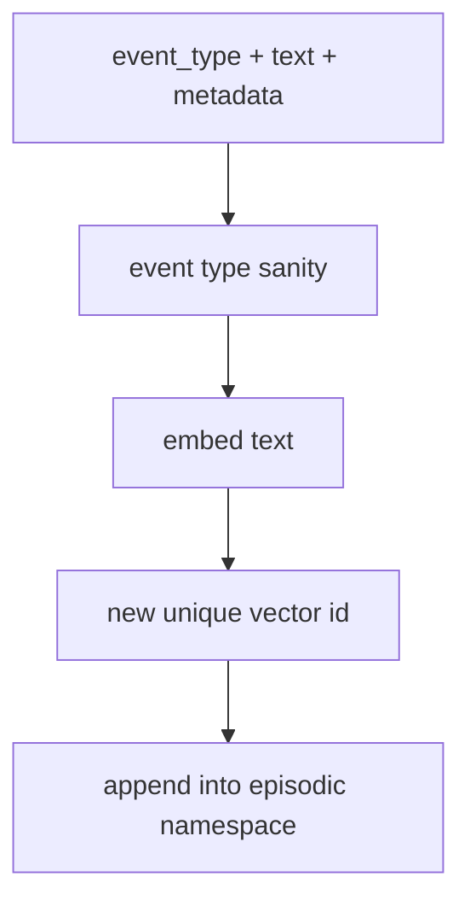

Episodic memory is the right layer for:
- “what has happened recently?”
- “what plan changes happened?”
- “what behavior pattern keeps recurring?”

It is not the right layer for authoritative completion truth.

---

## Backlog Memory Flow

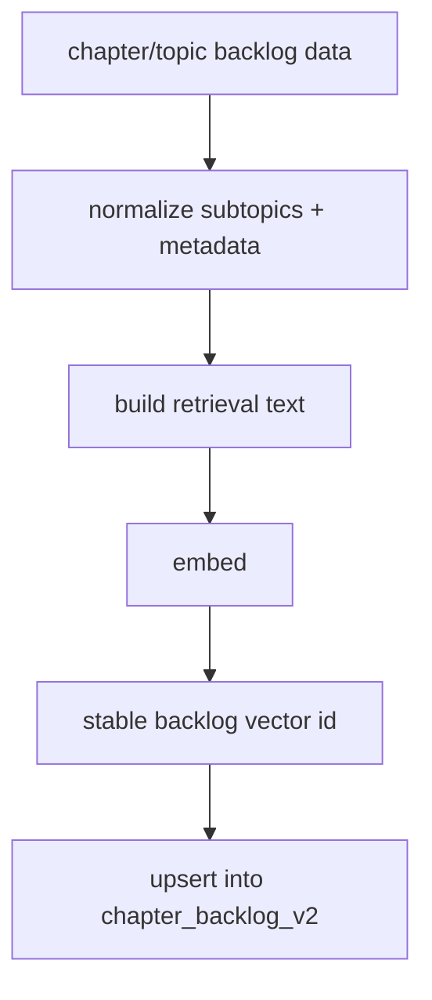

Important rule:

```text
Backlog is rewritten by match_key.
It is not append-only.
```

This lets the latest incomplete state replace older chapter memory.

---

## Syllabus Memory Flow

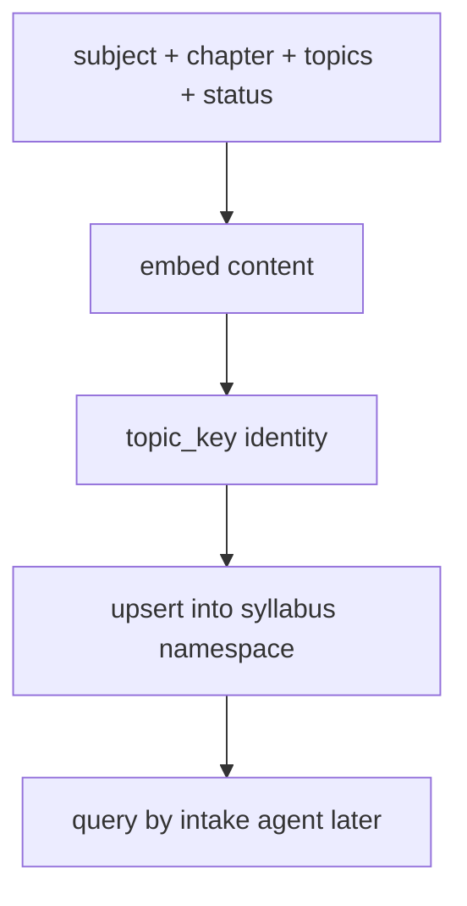

This namespace supports:
- subject/chapter suggestion
- scope grounding
- outdated/removed topic checks

---

## Full Memory Load

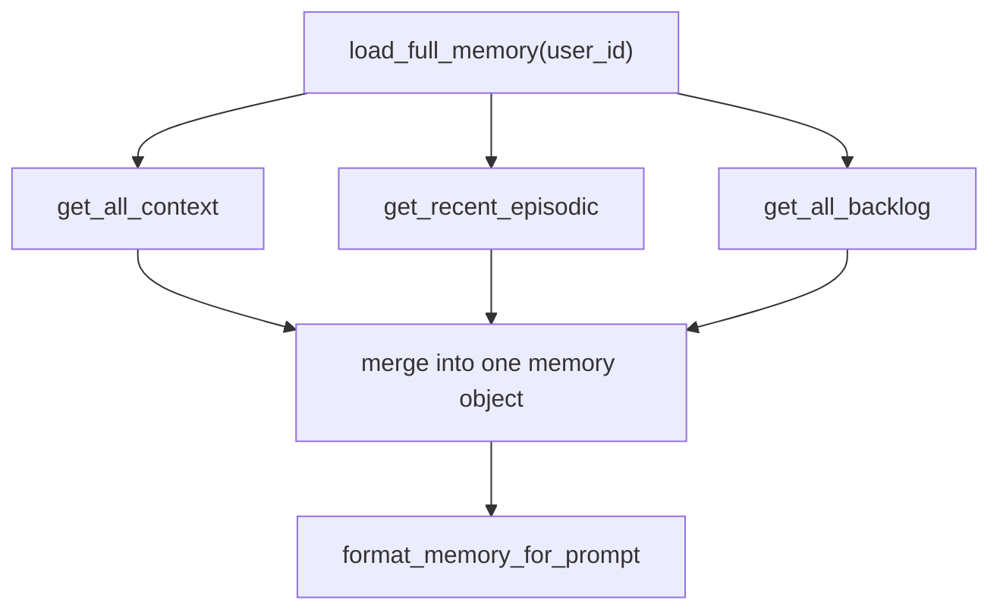

This is useful for prompt injection or memory dashboards, but still not a replacement for structured Neo4j truth.

---

## Relationship To Agents

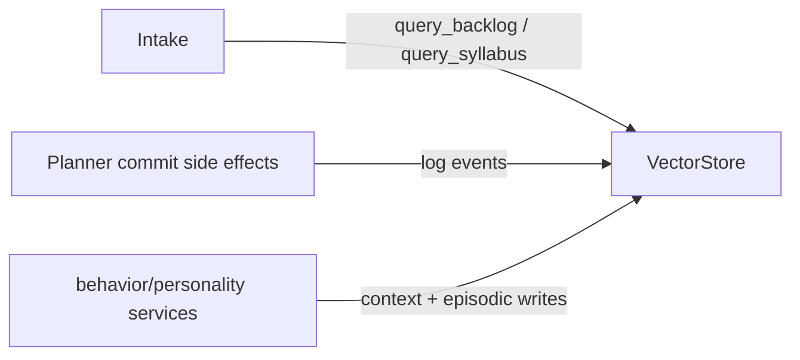

Typical usage:
- intake reads from vector memory
- planner commit writes to vector memory
- behavior analysis writes to context/episodic memory

---

## What Agents Should Trust

Good use:
- suggestion
- personalization
- backlog recall
- syllabus grounding
- recent-history hints

Bad use:
- authoritative completion truth
- exact active-plan state
- exact schedule state
- final commit status

The correct trust rule is:

```text
VectorStore is retrieval help.
Neo4j is authoritative truth.
```

---

## Debugging Questions

When vector-memory behavior looks wrong, ask:

1. Was Neo4j updated first?
2. Which namespace should have been written?
3. Was this supposed to append or overwrite?
4. Was the vector id stable or unique?
5. Did metadata normalization strip or rename something important?
6. Is the bug in retrieval ranking, or was the wrong memory written?

That usually separates:
- persistence-order bugs
- metadata-shape bugs
- retrieval-quality bugs
